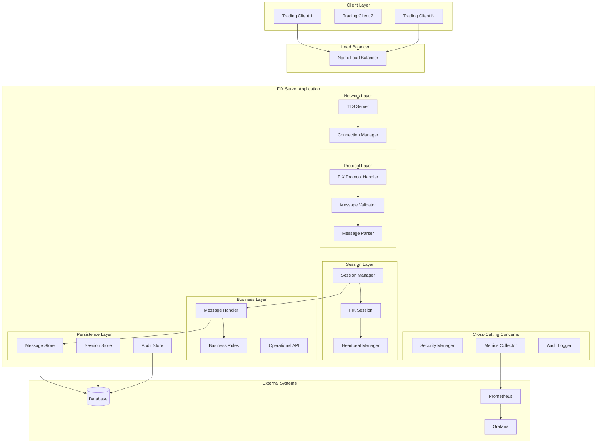

# FIX Server Design Document

## Overview

The FIX Server is designed as a high-performance, enterprise-grade financial messaging server that implements FIX protocol versions 4.4 and 5.0. The architecture follows a modular, event-driven design with clear separation of concerns, enabling scalability, maintainability, and operational excellence.

The system is built using Java with Spring Boot framework, leveraging proven enterprise patterns including dependency injection, aspect-oriented programming for cross-cutting concerns, and reactive programming for high-throughput message processing.

## Architecture

### High-Level Architecture



### Component Architecture

The system follows a layered architecture with the following key layers:

1. **Network Layer**: Handles TLS connections and raw socket management
2. **Protocol Layer**: Implements FIX protocol parsing, validation, and formatting
3. **Session Layer**: Manages FIX session lifecycle, heartbeats, and sequence numbers
4. **Business Layer**: Processes business logic and handles message routing
5. **Persistence Layer**: Provides durable storage for messages, sessions, and audit data
6. **Cross-Cutting Concerns**: Security, monitoring, and logging aspects

## Components and Interfaces

### Core Components

#### FIXServerApplication
```java
@SpringBootApplication
public class FIXServerApplication {
    // Main application entry point with graceful shutdown
    // Manages application lifecycle and configuration
    // Integrates with Spring Boot actuator for health checks
}
```

**Responsibilities:**
- Application bootstrap and configuration loading
- Graceful shutdown coordination
- Health check endpoint registration
- JVM and application metrics initialization

#### FIXServer
```java
@Component
public class FIXServer {
    private final TLSManager tlsManager;
    private final ConnectionManager connectionManager;
    private final SessionManager sessionManager;
    
    // Core server implementation
    public void start();
    public void stop();
    public void handleConnection(SocketChannel channel);
}
```

**Responsibilities:**
- TCP/TLS server socket management
- Connection acceptance and delegation
- Server lifecycle management
- Integration with connection pooling

#### FIXSession
```java
public class FIXSession {
    private final String sessionId;
    private final FIXProtocolHandler protocolHandler;
    private final MessageStore messageStore;
    private final HeartbeatManager heartbeatManager;
    
    // Session state management
    public void processMessage(FIXMessage message);
    public void sendMessage(FIXMessage message);
    public void handleHeartbeat();
    public void disconnect();
}
```

**Responsibilities:**
- Individual session state management
- Message sequence number tracking
- Heartbeat monitoring and test request handling
- Session authentication and authorization

#### FIXMessage and Protocol Handler
```java
public class FIXMessage {
    private final Map<Integer, String> fields;
    private final String messageType;
    private final int sequenceNumber;
    
    // Message representation and manipulation
}

@Component
public class FIXProtocolHandler {
    public FIXMessage parse(String rawMessage);
    public String format(FIXMessage message);
    public ValidationResult validate(FIXMessage message);
}
```

**Responsibilities:**
- FIX message parsing and formatting
- Protocol version negotiation (4.4/5.0)
- Message validation against FIX specifications
- Checksum calculation and verification

#### SessionManager
```java
@Component
public class SessionManager {
    private final Map<String, FIXSession> activeSessions;
    private final SessionStore sessionStore;
    private final ScheduledExecutorService timeoutExecutor;
    
    public FIXSession createSession(String sessionId);
    public void removeSession(String sessionId);
    public void handleTimeout(String sessionId);
}
```

**Responsibilities:**
- Session lifecycle management
- Timeout monitoring and cleanup
- Session recovery and reconnection
- Concurrent session limit enforcement

#### MessageStore
```java
@Repository
public interface MessageStore {
    void storeMessage(String sessionId, FIXMessage message);
    List<FIXMessage> getMessages(String sessionId, int fromSeqNum, int toSeqNum);
    void archiveMessages(String sessionId, LocalDateTime beforeDate);
    AuditTrail getAuditTrail(String sessionId, LocalDateTime from, LocalDateTime to);
}
```

**Responsibilities:**
- Persistent message storage
- Message replay functionality
- Audit trail maintenance
- Data archival and retention

### Security Components

#### TLSManager
```java
@Component
public class TLSManager {
    private final SSLContext sslContext;
    private final TrustManager[] trustManagers;
    private final KeyManager[] keyManagers;
    
    public SSLEngine createSSLEngine();
    public void validateCertificate(X509Certificate certificate);
    public void reloadCertificates();
}
```

**Responsibilities:**
- TLS 1.2/1.3 configuration and management
- Certificate validation and mutual authentication
- Cipher suite configuration
- Certificate hot-reloading

### Monitoring Components

#### MetricsCollector
```java
@Component
public class MetricsCollector {
    private final MeterRegistry meterRegistry;
    
    public void recordConnection(String sessionId);
    public void recordMessage(String messageType, String sessionId);
    public void recordLatency(Duration latency);
    public void recordError(String errorType);
}
```

**Responsibilities:**
- Prometheus metrics collection
- Performance monitoring
- Error rate tracking
- Custom business metrics

#### OperationalAPI
```java
@RestController
@RequestMapping("/api/admin")
public class OperationalAPI {
    @GetMapping("/sessions")
    public List<SessionInfo> getActiveSessions();
    
    @PostMapping("/sessions/{sessionId}/disconnect")
    public ResponseEntity<Void> disconnectSession(@PathVariable String sessionId);
    
    @GetMapping("/health")
    public HealthStatus getHealthStatus();
}
```

**Responsibilities:**
- REST API for administrative operations
- Session management endpoints
- System health and status reporting
- Configuration management interface

## Data Models

### Core Data Models

#### FIX Message Model
```java
public class FIXMessage {
    private String beginString;      // FIX version (8)
    private int bodyLength;          // Message length (9)
    private String messageType;      // Message type (35)
    private String senderCompId;     // Sender ID (49)
    private String targetCompId;     // Target ID (56)
    private int messageSequenceNumber; // Sequence number (34)
    private LocalDateTime sendingTime; // Sending time (52)
    private Map<Integer, String> fields; // All FIX fields
    private String checksum;         // Checksum (10)
}
```

#### Session State Model
```java
public class SessionState {
    private String sessionId;
    private String senderCompId;
    private String targetCompId;
    private SessionStatus status;
    private int incomingSequenceNumber;
    private int outgoingSequenceNumber;
    private LocalDateTime lastHeartbeat;
    private LocalDateTime sessionStartTime;
    private Duration heartbeatInterval;
}
```

#### Audit Record Model
```java
public class AuditRecord {
    private Long id;
    private String sessionId;
    private LocalDateTime timestamp;
    private AuditEventType eventType;
    private String messageType;
    private String rawMessage;
    private String clientIpAddress;
    private Map<String, Object> additionalData;
}
```

### Database Schema

The system uses a relational database (PostgreSQL recommended) with the following key tables:

- **sessions**: Session configuration and state
- **messages**: Persistent message storage
- **audit_log**: Comprehensive audit trail
- **sequence_numbers**: Sequence number tracking
- **certificates**: TLS certificate management

## Error Handling

### Error Handling Strategy

The system implements a comprehensive error handling strategy with multiple layers:

1. **Protocol Level**: FIX protocol reject messages for invalid messages
2. **Session Level**: Session-level error recovery and reconnection
3. **Application Level**: Graceful degradation and circuit breaker patterns
4. **System Level**: Global exception handling and alerting

### Error Categories

#### Protocol Errors
- Invalid message format
- Checksum validation failures
- Sequence number gaps
- Unknown message types

#### Session Errors
- Authentication failures
- Heartbeat timeouts
- Duplicate session attempts
- Session limit exceeded

#### System Errors
- Database connectivity issues
- TLS certificate problems
- Resource exhaustion
- Configuration errors

### Error Recovery Mechanisms

```java
@Component
public class ErrorRecoveryManager {
    public void handleProtocolError(FIXSession session, ProtocolError error);
    public void handleSessionError(FIXSession session, SessionError error);
    public void handleSystemError(SystemError error);
    public void initiateCircuitBreaker(String component);
}
```

## Testing Strategy

### Testing Pyramid

#### Unit Tests (70%)
- Component isolation testing
- Mock external dependencies
- Protocol parsing and validation
- Business logic verification
- Error handling scenarios

#### Integration Tests (20%)
- End-to-end message flow
- Database integration
- TLS handshake testing
- Session lifecycle testing
- API endpoint testing

#### Performance Tests (10%)
- Concurrent connection testing
- Message throughput benchmarks
- Memory and CPU profiling
- Load testing with realistic scenarios
- Stress testing for failure conditions

### Test Implementation

```java
@SpringBootTest
@TestPropertySource(locations = "classpath:test.properties")
public class FIXServerIntegrationTest {
    
    @Test
    public void testSessionLifecycle() {
        // Test complete session from logon to logout
    }
    
    @Test
    public void testMessageReplay() {
        // Test message persistence and replay functionality
    }
    
    @Test
    public void testConcurrentSessions() {
        // Test multiple simultaneous sessions
    }
}
```

### Performance Testing

- **Load Testing**: Simulate realistic trading volumes
- **Stress Testing**: Test system limits and failure modes
- **Endurance Testing**: Long-running stability tests
- **Spike Testing**: Handle sudden traffic increases

## Deployment Architecture

### Containerization

The application is containerized using Docker with multi-stage builds:

```dockerfile
FROM openjdk:17-jdk-slim as builder
# Build stage

FROM openjdk:17-jre-slim as runtime
# Runtime stage with minimal footprint
```

### Orchestration

Docker Compose configuration for development and testing:
- FIX Server container
- PostgreSQL database
- Prometheus monitoring
- Grafana dashboards
- Nginx load balancer

### Production Deployment

Kubernetes deployment with:
- Horizontal Pod Autoscaling
- ConfigMaps for configuration
- Secrets for certificates and credentials
- Persistent Volumes for data storage
- Service mesh integration (optional)

## Security Design

### TLS Configuration

- **Supported Versions**: TLS 1.2, TLS 1.3
- **Cipher Suites**: Strong ciphers only (AES-GCM, ChaCha20-Poly1305)
- **Certificate Validation**: Full chain validation with CRL checking
- **Mutual Authentication**: Client certificate requirement (configurable)

### Authentication and Authorization

- **Client Authentication**: X.509 certificate-based
- **Session Authorization**: Role-based access control
- **API Security**: JWT tokens for administrative API
- **Network Security**: IP whitelisting and rate limiting

### Audit and Compliance

- **Message Auditing**: All messages logged with timestamps
- **Security Events**: Authentication failures, certificate issues
- **Data Retention**: Configurable retention policies
- **Compliance Reporting**: Regulatory compliance features

## Performance Considerations

### Scalability Design

- **Horizontal Scaling**: Multiple server instances behind load balancer
- **Vertical Scaling**: Optimized for multi-core systems
- **Connection Pooling**: Efficient resource utilization
- **Async Processing**: Non-blocking I/O for high throughput

### Performance Targets

- **Concurrent Sessions**: 10,000+ simultaneous connections
- **Message Throughput**: 100,000+ messages per second
- **Latency**: Sub-millisecond message processing
- **Availability**: 99.9% uptime with graceful degradation

### Optimization Strategies

- **Memory Management**: Efficient object pooling and garbage collection tuning
- **CPU Optimization**: Lock-free data structures where possible
- **I/O Optimization**: NIO-based networking with efficient buffer management
- **Database Optimization**: Connection pooling, prepared statements, batch operations