# FIX Server Architecture and Message Flow

This document provides a comprehensive flowchart of the FIX server architecture, showing server startup, client connection, and message processing flows at the class level.

## Overall Architecture Flowchart

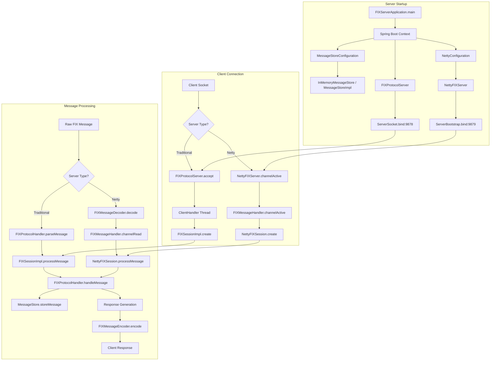

## Detailed Server Startup Flow

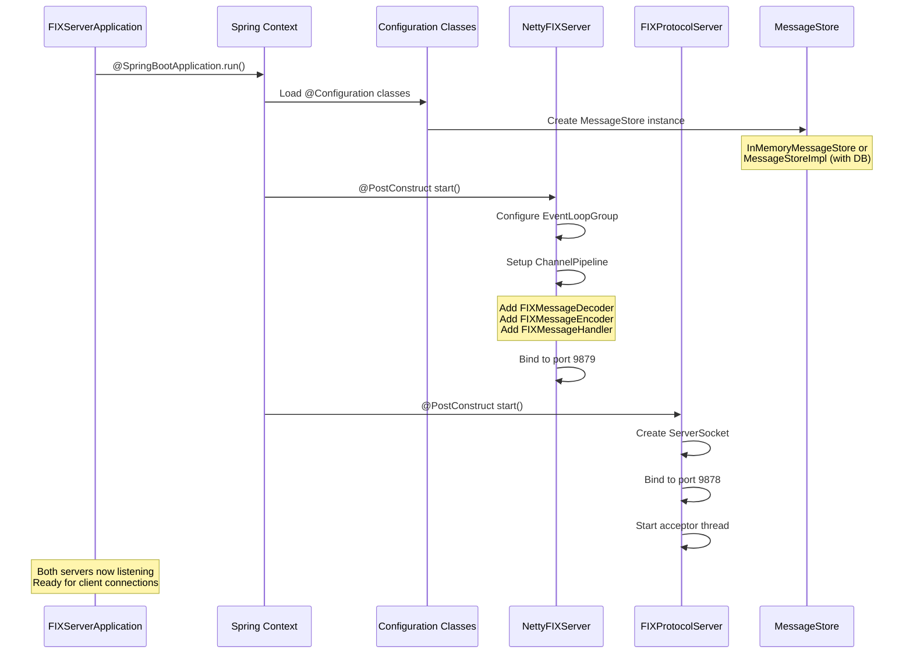

## Client Connection and Session Establishment

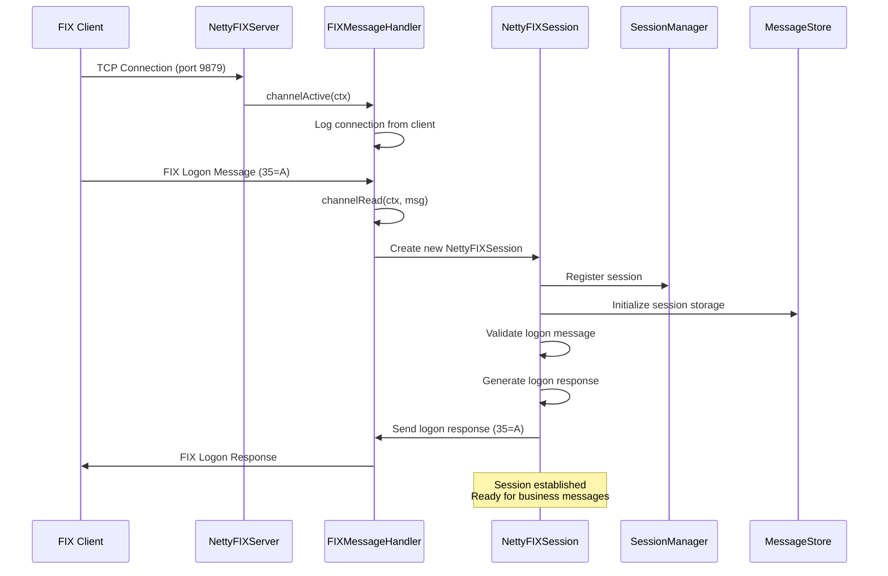

## Traditional Server Connection Flow

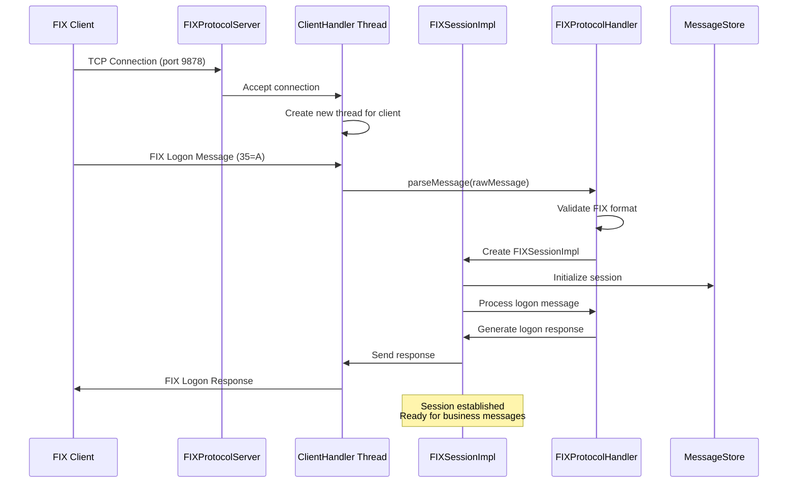

## Message Processing Flow (Netty)

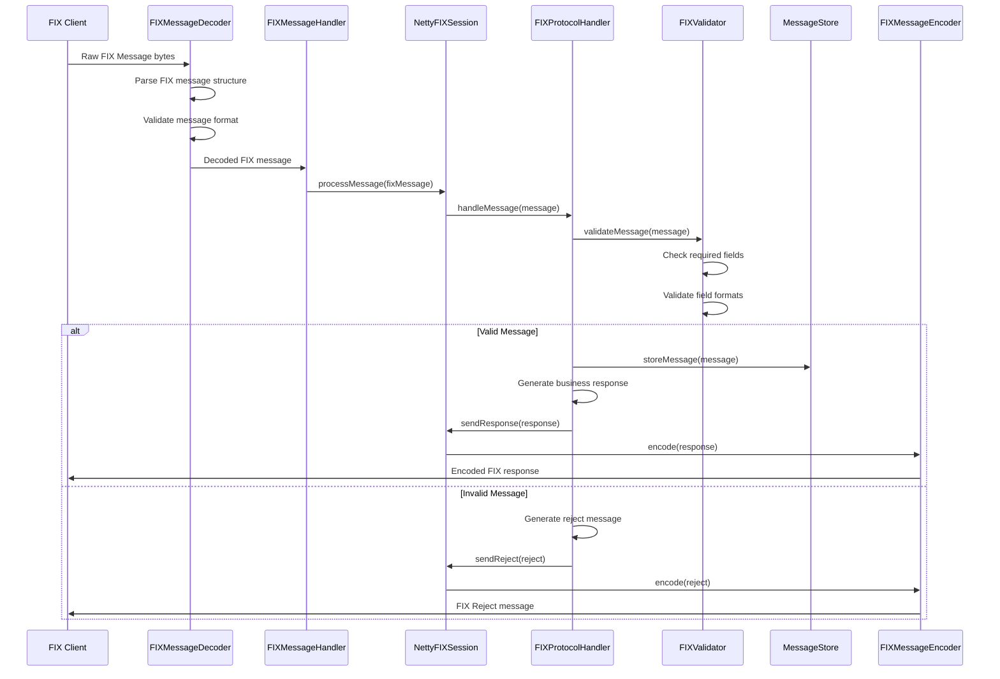

## Message Processing Flow (Traditional)

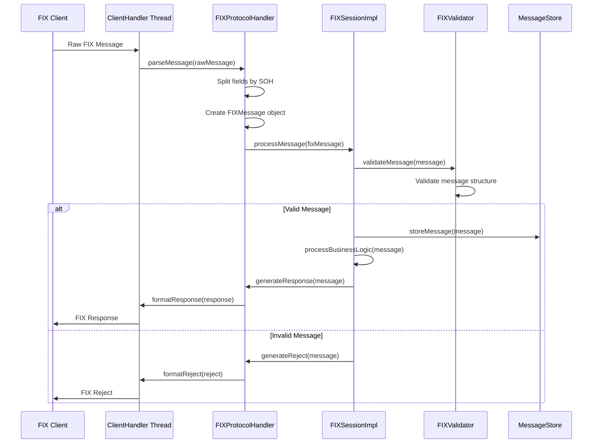

## Session Management Flow

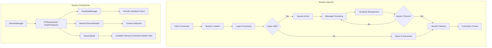

## Detailed Heartbeat Management Flow

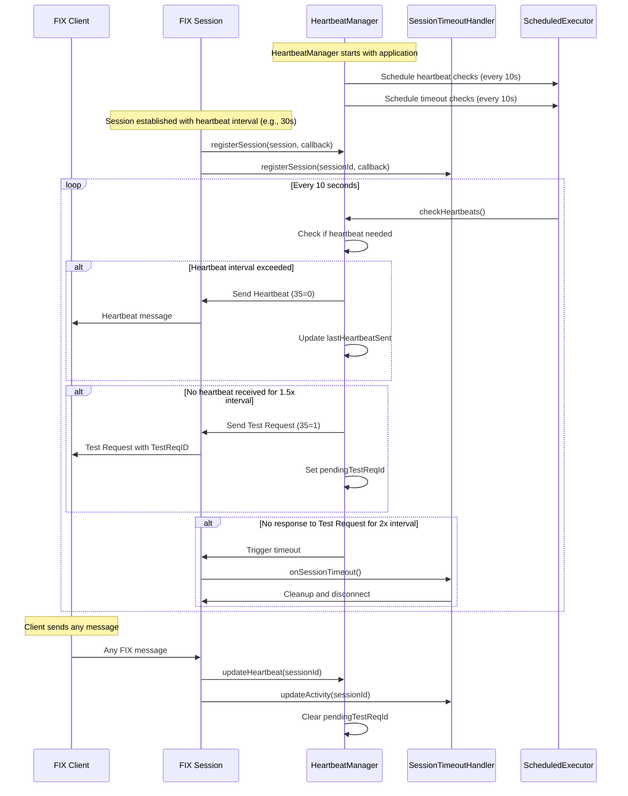

## Connection Loss and Recovery Flow

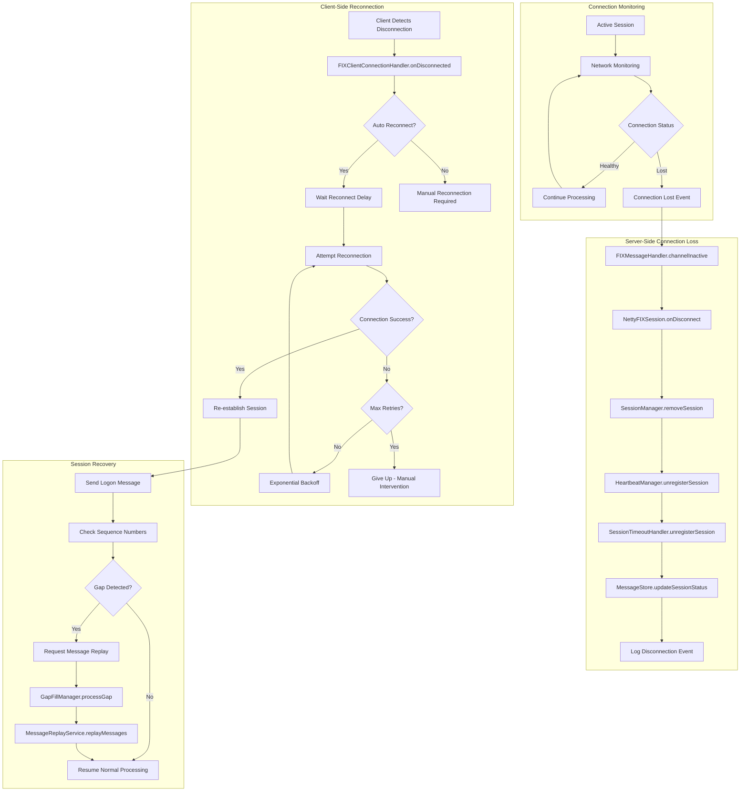

## Heartbeat State Machine

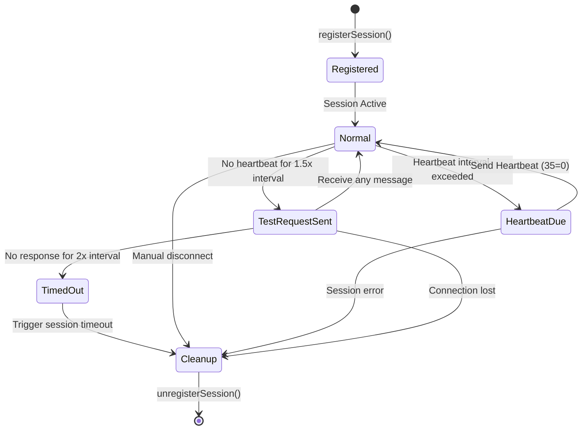

## Connection Recovery Strategies

```mermaid
graph TB
    subgraph "Client Reconnection Logic"
        A[Connection Lost] --> B[FIXClientConnectionHandler.onDisconnected]
        B --> C{Reconnect Policy}
        C -->|Immediate| D[Immediate Retry]
        C -->|Delayed| E[Fixed Delay]
        C -->|Exponential| F[Exponential Backoff]
        C -->|Manual| G[Wait for Manual Trigger]
        
        D --> H[Attempt Connection]
        E --> I[Wait Delay Period]
        F --> J[Calculate Backoff Delay]
        I --> H
        J --> K[Wait Backoff Period]
        K --> H
        
        H --> L{Connection Success?}
        L -->|Yes| M[Connection Established]
        L -->|No| N{Retry Count < Max?}
        N -->|Yes| O[Increment Retry Count]
        N -->|No| P[Max Retries Exceeded]
        O --> C
        P --> Q[Connection Failed - Manual Intervention]
        
        M --> R[Send Logon Message]
        R --> S[Session Recovery Process]
    end

    subgraph "Server Session Recovery"
        T[New Connection from Known Client] --> U[Check Session History]
        U --> V{Previous Session Exists?}
        V -->|Yes| W[Load Session State]
        V -->|No| X[Create New Session]
        W --> Y[Compare Sequence Numbers]
        Y --> Z{Sequence Gap?}
        Z -->|Yes| AA[Initiate Gap Fill]
        Z -->|No| BB[Resume Session]
        AA --> CC[Send Gap Fill Messages]
        CC --> BB
        X --> BB
    end
```

## Message Store Architecture

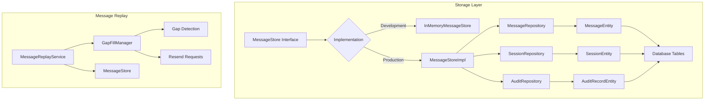

## Error Handling Flow

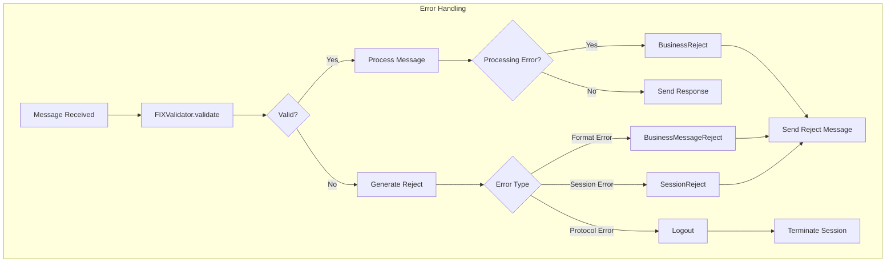

## Key Classes and Their Responsibilities

### Server Components
- **FIXServerApplication**: Main Spring Boot application entry point
- **NettyFIXServer**: High-performance Netty-based FIX server (port 9879)
- **FIXProtocolServer**: Traditional socket-based FIX server (port 9878)

### Message Processing
- **FIXMessageDecoder**: Netty decoder for incoming FIX messages
- **FIXMessageEncoder**: Netty encoder for outgoing FIX messages
- **FIXMessageHandler**: Netty channel handler for message processing
- **FIXProtocolHandler**: Core FIX protocol message parsing and handling

### Session Management
- **SessionManager**: Manages all active FIX sessions
- **FIXSessionImpl**: Traditional implementation of FIX session
- **NettyFIXSession**: Netty-specific FIX session implementation
- **HeartbeatManager**: Handles FIX heartbeat mechanism
- **SessionTimeoutHandler**: Manages session timeouts

### Message Validation and Storage
- **FIXValidator**: Validates FIX message format and content
- **MessageStore**: Interface for message persistence
- **InMemoryMessageStore**: In-memory implementation for development
- **MessageStoreImpl**: Database-backed implementation for production

### Client Components
- **FIXClient**: Client interface for connecting to FIX servers
- **FIXClientImpl**: Traditional socket-based client implementation
- **NettyFIXClientExample**: Netty-based client example

## Heartbeat Rules and Connection Recovery Scenarios

### Heartbeat Timing Rules

| Event | Timing | Action | Class Responsible |
|-------|--------|--------|-------------------|
| **Normal Heartbeat** | Every `HeartBtInt` seconds | Send Heartbeat (35=0) | `HeartbeatManager` |
| **Test Request** | No message for 1.5 × `HeartBtInt` | Send Test Request (35=1) | `HeartbeatManager` |
| **Session Timeout** | No response for 2.0 × `HeartBtInt` | Disconnect session | `SessionTimeoutHandler` |
| **Activity Update** | Any message received | Reset heartbeat timer | `HeartbeatManager.updateHeartbeat()` |

### Connection Loss Scenarios and Recovery Actions

#### Scenario 1: Network Interruption (Temporary)

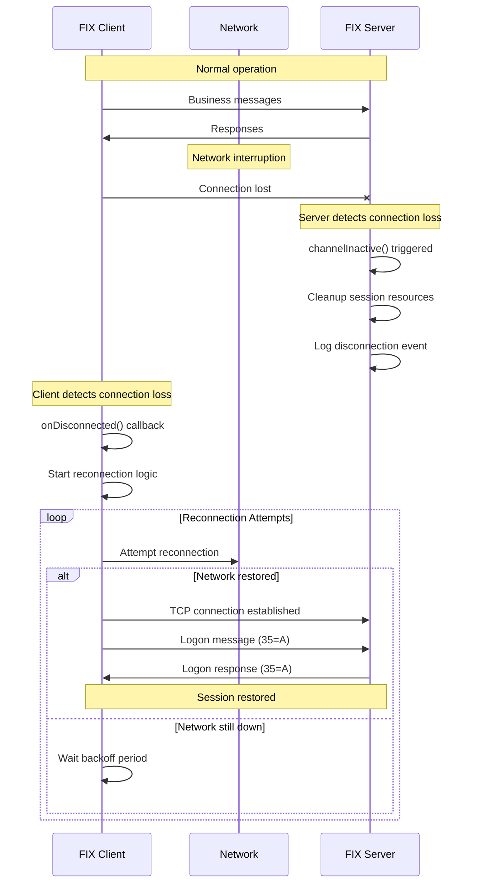

#### Scenario 2: Heartbeat Timeout

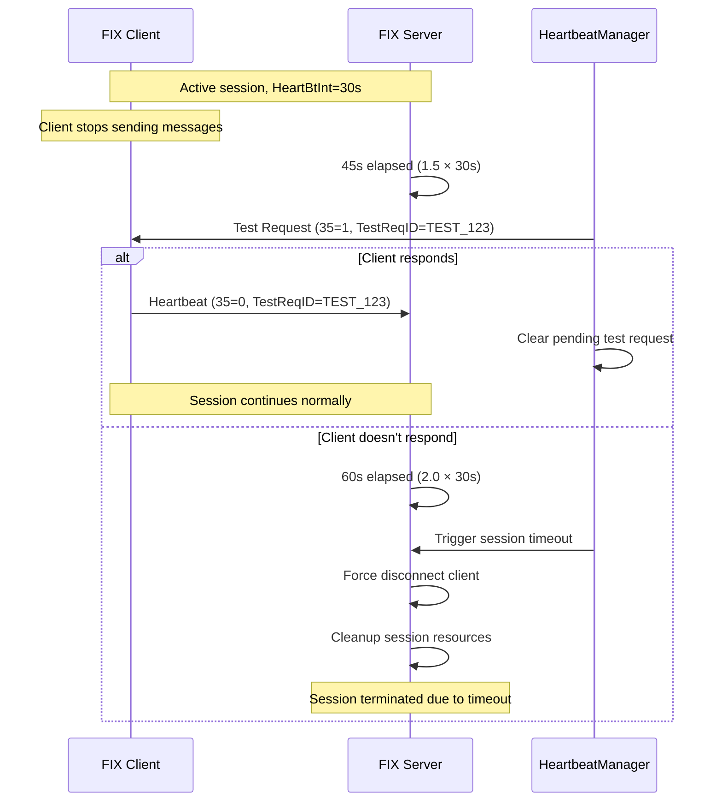

#### Scenario 3: Application Crash and Restart

**Client Application Crash:**
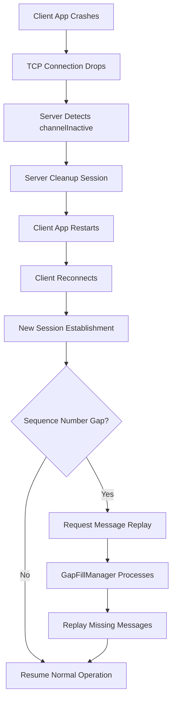

**Server Application Restart:**
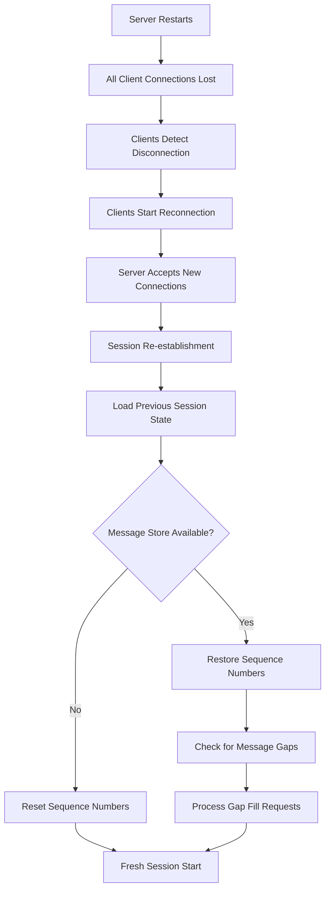

### Connection Recovery Configuration

#### Client-Side Recovery Settings
```java
// FIXClientConfiguration settings
public class ReconnectionConfig {
    private boolean autoReconnect = true;
    private int maxReconnectAttempts = 10;
    private int initialReconnectDelay = 1000; // ms
    private int maxReconnectDelay = 30000; // ms
    private double backoffMultiplier = 2.0;
    private boolean resetSeqNumOnReconnect = false;
}
```

#### Server-Side Session Management
```java
// Session cleanup actions on disconnection
public void onClientDisconnect(String sessionId) {
    // 1. Remove from active sessions
    sessionManager.removeSession(sessionId);
    
    // 2. Stop heartbeat monitoring
    heartbeatManager.unregisterSession(sessionId);
    
    // 3. Stop timeout monitoring
    timeoutHandler.unregisterSession(sessionId);
    
    // 4. Update session state in store
    messageStore.updateSessionState(sessionId, SessionState.DISCONNECTED);
    
    // 5. Log disconnection event
    auditLogger.logDisconnection(sessionId, reason);
}
```

### Message Replay and Gap Fill Process

When a client reconnects after a disconnection, the following sequence number reconciliation occurs:

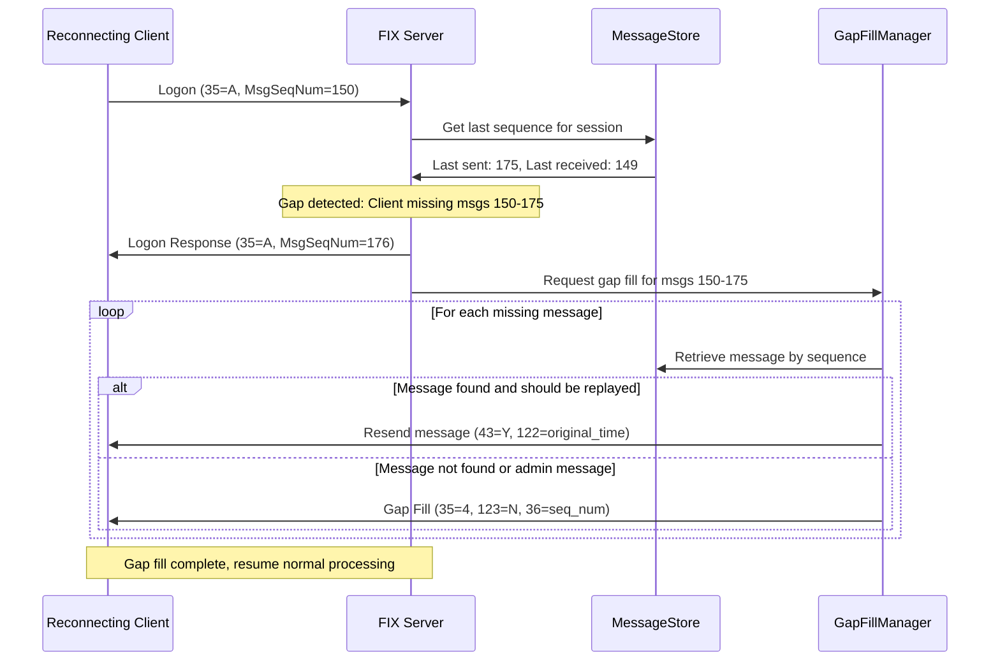

### Error Handling During Recovery

| Error Condition | Server Action | Client Action | Recovery Method |
|----------------|---------------|---------------|-----------------|
| **Invalid Sequence Number** | Send Reject (35=3) | Reset sequence or disconnect | Manual intervention |
| **Duplicate Logon** | Send Logout (35=5) | Wait and retry | Exponential backoff |
| **Session Limit Exceeded** | Send Reject (35=3) | Queue connection | Wait for available slot |
| **Authentication Failed** | Send Logout (35=5) | Check credentials | Manual credential update |
| **Message Store Unavailable** | Send Reject (35=3) | Retry later | Wait for store recovery |

This architecture provides both high-performance Netty-based processing and traditional socket-based connectivity, with comprehensive session management, message validation, storage capabilities, and robust connection recovery mechanisms.