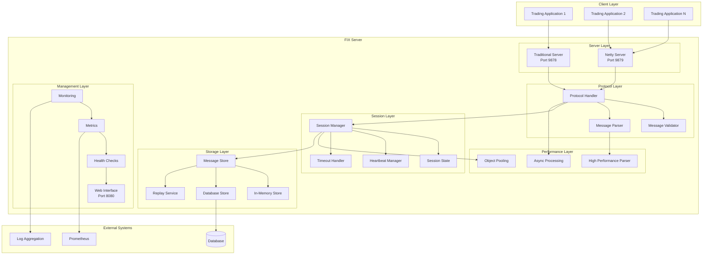
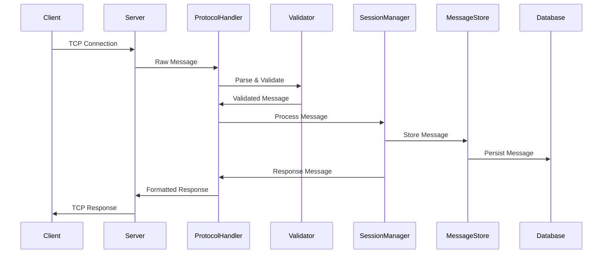
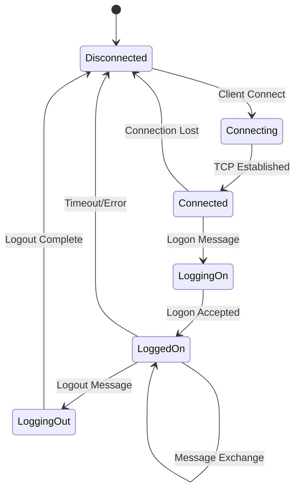
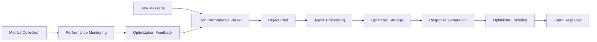

# FIX Server Architecture

## 📋 Overview

The FIX Server is designed as an enterprise-grade Financial Information eXchange (FIX) protocol server with a focus on high performance, scalability, and reliability. The architecture follows modern software engineering principles with clear separation of concerns, comprehensive testing, and production-ready operational features.

## 🏗️ System Architecture

### High-Level Architecture



### Core Components

#### 1. Server Layer
- **Traditional Server** (`FIXProtocolServer`) - Blocking I/O implementation for reliability
- **Netty Server** (`NettyFIXServer`) - Non-blocking NIO implementation for high performance

#### 2. Protocol Layer
- **Protocol Handler** (`FIXProtocolHandler`) - Core FIX message processing logic
- **Message Validator** (`FIXValidator`) - FIX message validation and compliance
- **Message Parser** - Standard and high-performance parsing implementations

#### 3. Session Layer
- **Session Manager** (`SessionManager`) - FIX session lifecycle management
- **Session State** (`SessionState`) - Session state tracking and persistence
- **Heartbeat Manager** (`HeartbeatManager`) - Heartbeat and keepalive management
- **Timeout Handler** (`SessionTimeoutHandler`) - Session timeout and cleanup

#### 4. Performance Layer
- **High Performance Parser** (`HighPerformanceMessageParser`) - Optimized message parsing
- **Object Pooling** - Memory-efficient object reuse
- **Async Processing** (`AsyncMessageStore`) - Non-blocking operations

#### 5. Storage Layer
- **Message Store** (`MessageStore`) - Message persistence interface
- **In-Memory Store** (`InMemoryMessageStore`) - Fast in-memory storage
- **Database Store** (`MessageStoreImpl`) - Persistent database storage
- **Replay Service** (`MessageReplayService`) - Message replay and gap fill

## 📦 Package Structure

```
src/main/java/com/fixserver/
├── FIXServerApplication.java           # Main application entry point
├── client/                             # FIX client implementation
│   ├── FIXClient.java                 # Client interface
│   ├── FIXClientImpl.java             # Client implementation
│   ├── FIXClientFactory.java          # Client factory
│   ├── FIXClientConfiguration.java    # Client configuration
│   ├── FIXClientConnectionHandler.java # Connection handling
│   ├── FIXClientMessageHandler.java   # Message handling
│   ├── FIXClientException.java        # Client exceptions
│   └── messages/                      # Client message types
│       └── OrderMessage.java          # Order message implementation
├── config/                            # Spring configuration
│   ├── MessageStoreConfiguration.java # Storage configuration
│   └── NettyConfiguration.java       # Netty configuration
├── core/                              # Core FIX components
│   ├── FIXMessage.java               # FIX message interface
│   └── FIXMessageImpl.java           # FIX message implementation
├── netty/                            # Netty server implementation
│   ├── NettyFIXServer.java          # Netty server
│   ├── FIXMessageDecoder.java       # Message decoder
│   ├── FIXMessageEncoder.java       # Message encoder
│   ├── FIXMessageHandler.java       # Message handler
│   ├── NettyFIXSession.java         # Netty session implementation
│   └── NettyFIXClientHandler.java   # Netty client handler
├── performance/                      # Performance optimizations
│   ├── HighPerformanceMessageParser.java  # Optimized parser
│   ├── AsyncMessageStore.java            # Async storage
│   ├── OptimizedFIXMessage.java          # Optimized message
│   ├── OptimizedNettyDecoder.java        # Optimized decoder
│   ├── PerformanceOptimizer.java         # Performance coordinator
│   └── JVMOptimizationConfig.java        # JVM optimizations
├── protocol/                         # FIX protocol implementation
│   ├── FIXProtocolHandler.java       # Protocol handler
│   ├── FIXValidator.java             # Message validator
│   ├── MessageType.java              # Message type definitions
│   ├── FIXTags.java                  # FIX tag constants
│   ├── FieldDefinition.java          # Field definitions
│   └── FIXParseException.java        # Parse exceptions
├── replay/                           # Message replay functionality
│   ├── MessageReplayService.java     # Replay service
│   └── GapFillManager.java          # Gap fill management
├── server/                           # Traditional server
│   └── FIXProtocolServer.java        # Traditional server implementation
├── session/                          # Session management
│   ├── FIXSession.java               # Session interface
│   ├── FIXSessionImpl.java           # Session implementation
│   ├── SessionManager.java           # Session manager
│   ├── SessionState.java             # Session state
│   ├── HeartbeatManager.java         # Heartbeat management
│   └── SessionTimeoutHandler.java    # Timeout handling
└── store/                            # Storage layer
    ├── MessageStore.java             # Storage interface
    ├── MessageStoreImpl.java         # Database storage implementation
    ├── InMemoryMessageStore.java     # In-memory storage
    ├── entity/                       # JPA entities
    │   ├── MessageEntity.java        # Message entity
    │   ├── SessionEntity.java        # Session entity
    │   └── AuditRecordEntity.java    # Audit record entity
    └── repository/                   # JPA repositories
        ├── MessageRepository.java    # Message repository
        ├── SessionRepository.java    # Session repository
        └── AuditRepository.java      # Audit repository
```

## 🔄 Data Flow

### 1. Message Processing Flow



### 2. Session Lifecycle



### 3. Performance Optimization Flow



## 🎯 Design Patterns

### 1. Factory Pattern
Used for creating FIX clients and messages:

```java
public class FIXClientFactory {
    public static FIXClient createClient(FIXClientConfiguration config) {
        return new FIXClientImpl(config);
    }
    
    public static FIXClientConfiguration.FIXClientConfigurationBuilder builder() {
        return FIXClientConfiguration.builder();
    }
}
```

### 2. Strategy Pattern
Used for different storage implementations:

```java
public interface MessageStore {
    void storeMessage(String sessionId, FIXMessage message, MessageDirection direction);
    List<FIXMessage> getMessages(String sessionId, int fromSeqNum, int toSeqNum);
}

@Component
public class DatabaseMessageStore implements MessageStore {
    // Database implementation
}

@Component
public class InMemoryMessageStore implements MessageStore {
    // In-memory implementation
}
```

### 3. Observer Pattern
Used for session events and monitoring:

```java
public interface SessionEventListener {
    void onSessionCreated(SessionEvent event);
    void onSessionDestroyed(SessionEvent event);
    void onMessageReceived(MessageEvent event);
    void onMessageSent(MessageEvent event);
}
```

### 4. Builder Pattern
Used for complex object construction:

```java
FIXMessage message = FIXMessage.builder()
    .messageType(MessageType.NEW_ORDER_SINGLE)
    .senderCompId("CLIENT1")
    .targetCompId("SERVER1")
    .field(FIXTags.SYMBOL, "AAPL")
    .field(FIXTags.SIDE, "1")
    .build();
```

### 5. Template Method Pattern
Used for message processing:

```java
public abstract class AbstractMessageProcessor {
    public final void processMessage(FIXMessage message, FIXSession session) {
        validateMessage(message);
        FIXMessage response = handleMessage(message, session);
        if (response != null) {
            sendResponse(response, session);
        }
    }
    
    protected abstract FIXMessage handleMessage(FIXMessage message, FIXSession session);
}
```

## 🚀 Performance Architecture

### 1. High-Performance Components

#### Message Parser Optimization
```java
@Component
public class HighPerformanceMessageParser {
    // Object pools for zero-allocation parsing
    private final ConcurrentLinkedQueue<OptimizedFIXMessage> messagePool;
    private final ThreadLocal<byte[]> tempBuffer;
    
    // Zero-copy parsing implementation
    public OptimizedFIXMessage parseMessage(byte[] data, int offset, int length) {
        // Optimized parsing logic
    }
}
```

#### Async Processing
```java
@Component
public class AsyncMessageStore {
    @Async("fixServerExecutor")
    public CompletableFuture<Void> storeMessageAsync(String sessionId, FIXMessage message) {
        // Async storage implementation
    }
}
```

#### Object Pooling
```java
@Component
public class MessageObjectPool {
    private final ObjectPool<FIXMessage> messagePool;
    private final ObjectPool<StringBuilder> stringBuilderPool;
    
    public FIXMessage borrowMessage() {
        return messagePool.borrowObject();
    }
    
    public void returnMessage(FIXMessage message) {
        message.reset();
        messagePool.returnObject(message);
    }
}
```

### 2. Netty Architecture

#### Server Bootstrap
```java
@Component
public class NettyFIXServer {
    private EventLoopGroup bossGroup;
    private EventLoopGroup workerGroup;
    
    public void start() {
        ServerBootstrap bootstrap = new ServerBootstrap()
            .group(bossGroup, workerGroup)
            .channel(NioServerSocketChannel.class)
            .childHandler(new ChannelInitializer<SocketChannel>() {
                @Override
                protected void initChannel(SocketChannel ch) {
                    ch.pipeline()
                        .addLast(new FIXMessageDecoder())
                        .addLast(new FIXMessageEncoder())
                        .addLast(new FIXMessageHandler());
                }
            });
    }
}
```

#### Message Pipeline
```java
public class FIXMessageDecoder extends ByteToMessageDecoder {
    @Override
    protected void decode(ChannelHandlerContext ctx, ByteBuf in, List<Object> out) {
        // High-performance message decoding
    }
}

public class FIXMessageHandler extends ChannelInboundHandlerAdapter {
    @Override
    public void channelRead(ChannelHandlerContext ctx, Object msg) {
        // Message processing logic
    }
}
```

## 🔒 Security Architecture

### 1. Authentication Layer
```java
@Component
public class FIXAuthenticationManager {
    public boolean authenticate(String compId, String password) {
        // Authentication logic
    }
    
    public void validateSession(FIXSession session) {
        // Session validation
    }
}
```

### 2. Authorization Layer
```java
@Component
public class FIXAuthorizationManager {
    public boolean isAuthorized(FIXSession session, FIXMessage message) {
        // Authorization logic
    }
}
```

### 3. Audit Layer
```java
@Component
public class AuditService {
    public void auditMessage(FIXSession session, FIXMessage message, AuditAction action) {
        // Audit logging
    }
}
```

## 📊 Monitoring Architecture

### 1. Metrics Collection
```java
@Component
public class FIXServerMetrics {
    private final Counter messageCounter;
    private final Timer processingTimer;
    private final Gauge activeSessionsGauge;
    
    public void recordMessage(String messageType) {
        messageCounter.increment(Tags.of("type", messageType));
    }
    
    public Timer.Sample startTimer() {
        return Timer.start(processingTimer);
    }
}
```

### 2. Health Indicators
```java
@Component
public class FIXServerHealthIndicator implements HealthIndicator {
    @Override
    public Health health() {
        if (isServerRunning()) {
            return Health.up()
                .withDetail("activeConnections", getActiveConnections())
                .withDetail("activeSessions", getActiveSessions())
                .build();
        } else {
            return Health.down()
                .withDetail("reason", "Server not running")
                .build();
        }
    }
}
```

## 🧪 Testing Architecture

### 1. Unit Testing
- **Component Isolation**: Each component is tested in isolation with mocked dependencies
- **Test Coverage**: Comprehensive test coverage for all critical paths
- **Performance Testing**: Micro-benchmarks for performance-critical components

### 2. Integration Testing
- **End-to-End Testing**: Full message flow testing
- **Database Integration**: Testing with real database connections
- **Network Testing**: Testing with actual TCP connections

### 3. Performance Testing
- **Load Testing**: High-volume message processing tests
- **Stress Testing**: Resource exhaustion and recovery tests
- **Latency Testing**: Sub-millisecond latency verification

## 🔧 Configuration Architecture

### 1. Layered Configuration
- **Default Configuration**: Built-in defaults for all settings
- **Environment Configuration**: Environment-specific overrides
- **Runtime Configuration**: Dynamic configuration updates

### 2. Configuration Validation
- **Startup Validation**: Configuration validation at startup
- **Runtime Validation**: Validation of configuration changes
- **Constraint Checking**: Business rule validation

## 📚 Additional Resources

- **[Development Guide](DEVELOPMENT_GUIDE.md)** - Development practices and guidelines
- **[API Reference](API_REFERENCE.md)** - Complete API documentation
- **[Performance Guide](../performance/PERFORMANCE_GUIDE.md)** - Performance optimization details
- **[Testing Guide](TESTING.md)** - Testing strategies and examples