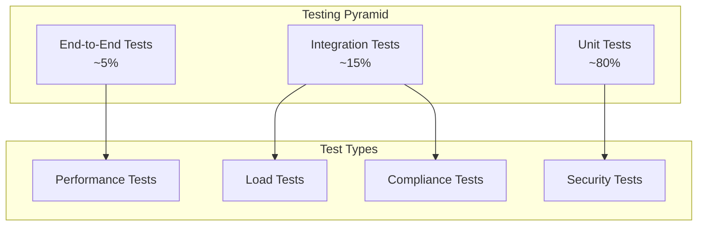

# FIX Server Testing Guide

## ✅ Current Test Status

**All Tests Passing** - Last updated: October 13, 2025

```
Tests run: 183, Failures: 0, Errors: 0, Skipped: 0
BUILD SUCCESS
```

**Recent Test Improvements:**
- Fixed checksum calculation and storage in FIXMessageImpl
- Improved timing-sensitive test reliability (heartbeat, timeout handlers)
- Enhanced performance test thresholds for cross-platform compatibility
- Fixed message validation tests with proper field setup
- Verified server operation with live connection testing

## 📋 Overview

This guide covers the comprehensive testing strategy for the FIX Server, including unit testing, integration testing, performance testing, and end-to-end testing approaches. The testing framework ensures reliability, performance, and correctness of the FIX protocol implementation.

## 🧪 Testing Strategy

### Testing Pyramid



### Test Categories

1. **Unit Tests** (80%) - Fast, isolated component tests
2. **Integration Tests** (15%) - Component interaction tests
3. **End-to-End Tests** (5%) - Full system workflow tests
4. **Performance Tests** - Latency and throughput validation
5. **Load Tests** - High-volume scenario testing
6. **Security Tests** - Authentication and authorization validation
7. **Compliance Tests** - FIX protocol compliance verification

## 🔧 Test Framework Setup

### Dependencies

The project uses the following testing frameworks:

```xml
<dependencies>
    <!-- JUnit 5 -->
    <dependency>
        <groupId>org.junit.jupiter</groupId>
        <artifactId>junit-jupiter</artifactId>
        <scope>test</scope>
    </dependency>
    
    <!-- Mockito -->
    <dependency>
        <groupId>org.mockito</groupId>
        <artifactId>mockito-core</artifactId>
        <scope>test</scope>
    </dependency>
    
    <!-- Spring Boot Test -->
    <dependency>
        <groupId>org.springframework.boot</groupId>
        <artifactId>spring-boot-starter-test</artifactId>
        <scope>test</scope>
    </dependency>
    
    <!-- Testcontainers -->
    <dependency>
        <groupId>org.testcontainers</groupId>
        <artifactId>junit-jupiter</artifactId>
        <scope>test</scope>
    </dependency>
    
    <!-- AssertJ -->
    <dependency>
        <groupId>org.assertj</groupId>
        <artifactId>assertj-core</artifactId>
        <scope>test</scope>
    </dependency>
</dependencies>
```

### Test Configuration

#### Test Application Properties (`application-test.yml`)
```yaml
spring:
  profiles:
    active: test
  
  # In-memory database for tests
  datasource:
    url: jdbc:h2:mem:testdb
    driver-class-name: org.h2.Driver
    username: sa
    password: 
  
  jpa:
    hibernate:
      ddl-auto: create-drop
    show-sql: false

# Test-specific FIX server configuration
fix:
  server:
    port: 0  # Random port for tests
    netty:
      port: 0  # Random port for tests
      worker-threads: 1
      max-connections: 10

# Disable security for tests
management:
  security:
    enabled: false

logging:
  level:
    com.fixserver: DEBUG
    org.springframework: WARN
```

## 🧩 Unit Testing

### Component Testing Structure

```
src/test/java/com/fixserver/
├── core/                              # Core component tests
│   └── FIXMessageImplTest.java
├── protocol/                          # Protocol tests
│   ├── FIXProtocolHandlerTest.java
│   ├── FIXValidatorTest.java
│   └── MessageTypeTest.java
├── session/                           # Session management tests
│   ├── FIXSessionImplTest.java
│   ├── SessionStateTest.java
│   ├── HeartbeatManagerTest.java
│   └── SessionTimeoutHandlerTest.java
├── store/                             # Storage tests
│   └── MessageStoreImplTest.java
├── client/                            # Client tests
│   ├── FIXClientImplTest.java
│   └── messages/
│       └── OrderMessageTest.java
├── netty/                             # Netty server tests
│   ├── NettyFIXServerTest.java
│   └── NettyFIXServerIntegrationTest.java
├── performance/                       # Performance tests
│   ├── PerformanceOptimizationTest.java
│   ├── PerformanceIntegrationTest.java
│   └── RealWorldPerformanceTest.java
└── replay/                            # Replay functionality tests
    ├── MessageReplayServiceTest.java
    └── GapFillManagerTest.java
```

### Unit Test Examples

#### FIX Message Testing
```java
@ExtendWith(MockitoExtension.class)
class FIXMessageImplTest {
    
    private FIXMessage message;
    
    @BeforeEach
    void setUp() {
        message = new FIXMessageImpl("FIX.4.4", "D");
    }
    
    @Test
    @DisplayName("Should create message with correct version and type")
    void shouldCreateMessageWithCorrectVersionAndType() {
        assertThat(message.getVersion()).isEqualTo("FIX.4.4");
        assertThat(message.getMessageType()).isEqualTo("D");
    }
    
    @Test
    @DisplayName("Should set and get field values correctly")
    void shouldSetAndGetFieldValues() {
        message.setField(FIXTags.SYMBOL, "AAPL");
        message.setField(FIXTags.SIDE, "1");
        
        assertThat(message.getField(FIXTags.SYMBOL)).isEqualTo("AAPL");
        assertThat(message.getField(FIXTags.SIDE)).isEqualTo("1");
        assertThat(message.hasField(FIXTags.SYMBOL)).isTrue();
        assertThat(message.hasField(FIXTags.PRICE)).isFalse();
    }
    
    @Test
    @DisplayName("Should generate correct FIX string format")
    void shouldGenerateCorrectFixStringFormat() {
        message.setField(FIXTags.SENDER_COMP_ID, "CLIENT1");
        message.setField(FIXTags.TARGET_COMP_ID, "SERVER1");
        message.setField(FIXTags.SYMBOL, "AAPL");
        
        String fixString = message.toFixString();
        
        assertThat(fixString).contains("8=FIX.4.4");
        assertThat(fixString).contains("35=D");
        assertThat(fixString).contains("49=CLIENT1");
        assertThat(fixString).contains("56=SERVER1");
        assertThat(fixString).contains("55=AAPL");
    }
}
```

#### Session Management Testing
```java
@ExtendWith(MockitoExtension.class)
class FIXSessionImplTest {
    
    @Mock
    private MessageStore messageStore;
    
    @Mock
    private SessionManager sessionManager;
    
    private FIXSession session;
    private static final String SESSION_ID = "CLIENT1->SERVER1";
    
    @BeforeEach
    void setUp() {
        session = new FIXSessionImpl(SESSION_ID, "CLIENT1", "SERVER1", 
                                   messageStore, sessionManager);
    }
    
    @Test
    @DisplayName("Should handle logon message correctly")
    void shouldHandleLogonMessageCorrectly() {
        FIXMessage logonMessage = new FIXMessageImpl("FIX.4.4", "A");
        logonMessage.setField(FIXTags.HEARTBEAT_INTERVAL, "30");
        logonMessage.setField(FIXTags.RESET_SEQ_NUM_FLAG, "Y");
        
        CompletableFuture<Void> logonFuture = session.logon(30, "0");
        FIXMessage response = session.processMessage(logonMessage);
        
        assertThat(session.getState()).isEqualTo(SessionState.LOGGED_ON);
        assertThat(response).isNotNull();
        assertThat(response.getMessageType()).isEqualTo("A"); // Logon response
        assertThat(logonFuture).isCompleted();
    }
    
    @Test
    @DisplayName("Should validate sequence numbers")
    void shouldValidateSequenceNumbers() {
        // Logon first
        session.logon(30, "0");
        FIXMessage logonMessage = new FIXMessageImpl("FIX.4.4", "A");
        logonMessage.setField(FIXTags.MSG_SEQ_NUM, "1");
        session.processMessage(logonMessage);
        
        // Send message with correct sequence number
        FIXMessage message1 = new FIXMessageImpl("FIX.4.4", "0");
        message1.setField(FIXTags.MSG_SEQ_NUM, "2");
        FIXMessage response1 = session.processMessage(message1);
        
        assertThat(response1).isNull(); // Heartbeat doesn't require response
        assertThat(session.getNextSeqNumIn()).isEqualTo(3);
        
        // Send message with incorrect sequence number
        FIXMessage message2 = new FIXMessageImpl("FIX.4.4", "0");
        message2.setField(FIXTags.MSG_SEQ_NUM, "5"); // Gap in sequence
        FIXMessage response2 = session.processMessage(message2);
        
        assertThat(response2).isNotNull();
        assertThat(response2.getMessageType()).isEqualTo("2"); // Resend Request
    }
}
```

#### Protocol Handler Testing
```java
@ExtendWith(MockitoExtension.class)
class FIXProtocolHandlerTest {
    
    @Mock
    private SessionManager sessionManager;
    
    @Mock
    private FIXValidator validator;
    
    @InjectMocks
    private FIXProtocolHandler protocolHandler;
    
    @Test
    @DisplayName("Should process valid message successfully")
    void shouldProcessValidMessageSuccessfully() throws Exception {
        String rawMessage = "8=FIX.4.4|9=65|35=A|34=1|49=CLIENT1|52=20250101-10:30:00|56=SERVER1|98=0|108=30|10=123|";
        FIXSession mockSession = mock(FIXSession.class);
        
        when(sessionManager.getSession("CLIENT1->SERVER1")).thenReturn(mockSession);
        when(mockSession.processMessage(any(FIXMessage.class))).thenReturn(null);
        
        assertDoesNotThrow(() -> {
            protocolHandler.handleMessage(rawMessage, mockSession);
        });
        
        verify(validator).validate(any(FIXMessage.class));
        verify(mockSession).processMessage(any(FIXMessage.class));
    }
    
    @Test
    @DisplayName("Should handle invalid message gracefully")
    void shouldHandleInvalidMessageGracefully() throws Exception {
        String invalidMessage = "invalid_fix_message";
        FIXSession mockSession = mock(FIXSession.class);
        
        doThrow(new FIXParseException("Invalid message format"))
            .when(validator).validate(any(FIXMessage.class));
        
        assertDoesNotThrow(() -> {
            protocolHandler.handleMessage(invalidMessage, mockSession);
        });
        
        verify(mockSession).sendReject(anyString(), anyString());
    }
}
```

### Performance Unit Tests

```java
@ExtendWith(MockitoExtension.class)
class PerformanceOptimizationTest {
    
    private HighPerformanceMessageParser optimizedParser;
    private StandardMessageParser standardParser;
    
    @BeforeEach
    void setUp() {
        optimizedParser = new HighPerformanceMessageParser();
        standardParser = new StandardMessageParser();
    }
    
    @Test
    @DisplayName("Optimized message parsing should be faster than standard")
    void testOptimizedParsingPerformance() {
        String testMessage = "8=FIX.4.4|9=154|35=D|34=2|49=CLIENT1|52=20250101-10:30:01|56=SERVER1|11=ORDER123|21=1|38=100|40=2|44=150.00|54=1|55=AAPL|59=0|10=456|";
        byte[] messageBytes = testMessage.getBytes(StandardCharsets.UTF_8);
        
        // Warm up
        for (int i = 0; i < 1000; i++) {
            optimizedParser.parseMessage(messageBytes, 0, messageBytes.length);
            standardParser.parseMessage(testMessage);
        }
        
        // Measure optimized parser
        long optimizedStart = System.nanoTime();
        for (int i = 0; i < 10000; i++) {
            optimizedParser.parseMessage(messageBytes, 0, messageBytes.length);
        }
        long optimizedTime = System.nanoTime() - optimizedStart;
        
        // Measure standard parser
        long standardStart = System.nanoTime();
        for (int i = 0; i < 10000; i++) {
            standardParser.parseMessage(testMessage);
        }
        long standardTime = System.nanoTime() - standardStart;
        
        // Optimized should be at least 50% faster
        assertThat(optimizedTime).isLessThan(standardTime * 0.5);
        
        // Average parsing time should be under 100 microseconds
        double avgOptimizedTime = optimizedTime / 10000.0 / 1000.0; // microseconds
        assertThat(avgOptimizedTime).isLessThan(100.0);
    }
}
```

## 🔗 Integration Testing

### Integration Test Structure

```java
@SpringBootTest
@ActiveProfiles("test")
@TestPropertySource(properties = {
    "fix.server.port=0",
    "fix.server.netty.port=0"
})
class FIXServerIntegrationTest {
    
    @Autowired
    private FIXProtocolServer fixServer;
    
    @Autowired
    private NettyFIXServer nettyServer;
    
    @Autowired
    private SessionManager sessionManager;
    
    @Test
    @DisplayName("Should handle complete client session lifecycle")
    void shouldHandleCompleteClientSessionLifecycle() throws Exception {
        // Test implementation
    }
}
```

### Database Integration Testing

```java
@SpringBootTest
@Testcontainers
@ActiveProfiles("test")
class MessageStoreIntegrationTest {
    
    @Container
    static PostgreSQLContainer<?> postgres = new PostgreSQLContainer<>("postgres:13")
            .withDatabaseName("testdb")
            .withUsername("test")
            .withPassword("test");
    
    @DynamicPropertySource
    static void configureProperties(DynamicPropertyRegistry registry) {
        registry.add("spring.datasource.url", postgres::getJdbcUrl);
        registry.add("spring.datasource.username", postgres::getUsername);
        registry.add("spring.datasource.password", postgres::getPassword);
    }
    
    @Autowired
    private MessageStore messageStore;
    
    @Test
    @DisplayName("Should persist and retrieve messages correctly")
    void shouldPersistAndRetrieveMessagesCorrectly() {
        // Test implementation
    }
}
```

### Netty Server Integration Testing

```java
@SpringBootTest
@ActiveProfiles("test")
class NettyFIXServerIntegrationTest {
    
    @Autowired
    private NettyFIXServer nettyServer;
    
    @LocalServerPort
    private int nettyPort;
    
    @Test
    @DisplayName("Should handle multiple concurrent connections")
    void shouldHandleMultipleConcurrentConnections() throws Exception {
        int numberOfClients = 10;
        CountDownLatch latch = new CountDownLatch(numberOfClients);
        List<CompletableFuture<Void>> futures = new ArrayList<>();
        
        for (int i = 0; i < numberOfClients; i++) {
            final int clientId = i;
            CompletableFuture<Void> future = CompletableFuture.runAsync(() -> {
                try {
                    FIXClientConfiguration config = FIXClientConfiguration.builder()
                        .host("localhost")
                        .port(nettyPort)
                        .senderCompId("CLIENT" + clientId)
                        .targetCompId("SERVER1")
                        .build();
                    
                    FIXClient client = FIXClientFactory.createClient(config);
                    client.connect().get(5, TimeUnit.SECONDS);
                    
                    // Send test message
                    FIXMessage message = OrderMessage.marketOrder("ORDER" + clientId, "AAPL", 100, OrderSide.BUY)
                        .toFIXMessage();
                    client.sendMessage(message).get(1, TimeUnit.SECONDS);
                    
                    client.disconnect().get(1, TimeUnit.SECONDS);
                    latch.countDown();
                } catch (Exception e) {
                    throw new RuntimeException(e);
                }
            });
            futures.add(future);
        }
        
        // Wait for all clients to complete
        assertThat(latch.await(30, TimeUnit.SECONDS)).isTrue();
        
        // Verify no exceptions
        for (CompletableFuture<Void> future : futures) {
            assertThat(future).isCompleted();
            assertThat(future.isCompletedExceptionally()).isFalse();
        }
    }
}
```

## 🚀 Performance Testing

### Load Testing

```java
@SpringBootTest
@ActiveProfiles("test")
class LoadTest {
    
    @Test
    @DisplayName("Should handle high message throughput")
    void shouldHandleHighMessageThroughput() throws Exception {
        int messagesPerSecond = 10000;
        int testDurationSeconds = 10;
        int totalMessages = messagesPerSecond * testDurationSeconds;
        
        CountDownLatch latch = new CountDownLatch(totalMessages);
        AtomicInteger successCount = new AtomicInteger(0);
        AtomicInteger errorCount = new AtomicInteger(0);
        
        // Create multiple clients
        List<FIXClient> clients = new ArrayList<>();
        for (int i = 0; i < 10; i++) {
            FIXClientConfiguration config = FIXClientConfiguration.builder()
                .host("localhost")
                .port(nettyPort)
                .senderCompId("LOAD_CLIENT" + i)
                .targetCompId("SERVER1")
                .build();
            
            FIXClient client = FIXClientFactory.createClient(config);
            client.setMessageHandler((c, msg) -> {
                successCount.incrementAndGet();
                latch.countDown();
            });
            client.connect().get();
            clients.add(client);
        }
        
        // Send messages at target rate
        ScheduledExecutorService scheduler = Executors.newScheduledThreadPool(10);
        long intervalNanos = 1_000_000_000L / messagesPerSecond;
        
        for (int i = 0; i < totalMessages; i++) {
            final int messageId = i;
            scheduler.schedule(() -> {
                try {
                    FIXClient client = clients.get(messageId % clients.size());
                    FIXMessage message = OrderMessage.marketOrder("LOAD_ORDER" + messageId, "AAPL", 100, OrderSide.BUY)
                        .toFIXMessage();
                    client.sendMessage(message);
                } catch (Exception e) {
                    errorCount.incrementAndGet();
                    latch.countDown();
                }
            }, i * intervalNanos, TimeUnit.NANOSECONDS);
        }
        
        // Wait for completion
        assertThat(latch.await(testDurationSeconds + 10, TimeUnit.SECONDS)).isTrue();
        
        // Verify results
        assertThat(errorCount.get()).isLessThan(totalMessages * 0.01); // Less than 1% errors
        assertThat(successCount.get()).isGreaterThan(totalMessages * 0.95); // At least 95% success
        
        // Cleanup
        for (FIXClient client : clients) {
            client.disconnect().get();
        }
        scheduler.shutdown();
    }
}
```

### Latency Testing

```java
@Test
@DisplayName("Should maintain low latency under load")
void shouldMaintainLowLatencyUnderLoad() throws Exception {
    List<Long> latencies = new ArrayList<>();
    int numberOfMessages = 1000;
    
    FIXClient client = FIXClientFactory.createClient("localhost", nettyPort, "LATENCY_CLIENT", "SERVER1");
    
    client.setMessageHandler((c, msg) -> {
        long receiveTime = System.nanoTime();
        long sendTime = Long.parseLong(msg.getField(FIXTags.SENDING_TIME));
        latencies.add(receiveTime - sendTime);
    });
    
    client.connect().get();
    
    for (int i = 0; i < numberOfMessages; i++) {
        FIXMessage message = OrderMessage.marketOrder("LATENCY_ORDER" + i, "AAPL", 100, OrderSide.BUY)
            .toFIXMessage();
        message.setField(FIXTags.SENDING_TIME, String.valueOf(System.nanoTime()));
        client.sendMessage(message).get();
    }
    
    // Wait for all responses
    Thread.sleep(5000);
    
    // Calculate latency statistics
    latencies.sort(Long::compareTo);
    long p50 = latencies.get(latencies.size() / 2);
    long p95 = latencies.get((int) (latencies.size() * 0.95));
    long p99 = latencies.get((int) (latencies.size() * 0.99));
    
    // Convert to microseconds
    double p50Micros = p50 / 1000.0;
    double p95Micros = p95 / 1000.0;
    double p99Micros = p99 / 1000.0;
    
    // Assert latency requirements
    assertThat(p50Micros).isLessThan(100.0); // P50 < 100μs
    assertThat(p95Micros).isLessThan(500.0); // P95 < 500μs
    assertThat(p99Micros).isLessThan(1000.0); // P99 < 1ms
    
    client.disconnect().get();
}
```

## 🔒 Security Testing

### Authentication Testing

```java
@SpringBootTest
@ActiveProfiles("test")
class SecurityTest {
    
    @Test
    @DisplayName("Should reject unauthenticated connections")
    void shouldRejectUnauthenticatedConnections() {
        // Test implementation for authentication
    }
    
    @Test
    @DisplayName("Should validate message integrity")
    void shouldValidateMessageIntegrity() {
        // Test implementation for message validation
    }
}
```

## 📊 Test Execution

### Running Tests

```bash
# Run all tests
./mvnw test

# Run specific test class
./mvnw test -Dtest=FIXMessageImplTest

# Run tests with specific profile
./mvnw test -Dspring.profiles.active=test

# Run performance tests only
./mvnw test -Dtest=*PerformanceTest

# Run integration tests only
./mvnw test -Dtest=*IntegrationTest

# Run with coverage
./mvnw test jacoco:report
```

### Test Reports

```bash
# Generate test report
./mvnw surefire-report:report

# Generate coverage report
./mvnw jacoco:report

# View reports
open target/site/surefire-report.html
open target/site/jacoco/index.html
```

### Continuous Integration

```yaml
# GitHub Actions example
name: Tests
on: [push, pull_request]

jobs:
  test:
    runs-on: ubuntu-latest
    steps:
      - uses: actions/checkout@v2
      - uses: actions/setup-java@v2
        with:
          java-version: '11'
      - name: Run tests
        run: ./mvnw test
      - name: Generate coverage report
        run: ./mvnw jacoco:report
      - name: Upload coverage to Codecov
        uses: codecov/codecov-action@v1
```

## 📋 Test Best Practices

### 1. Test Naming
- Use descriptive test method names
- Follow the pattern: `should[ExpectedBehavior]When[StateUnderTest]`
- Use `@DisplayName` for complex scenarios

### 2. Test Structure
- Follow Arrange-Act-Assert pattern
- Use `@BeforeEach` and `@AfterEach` for setup/cleanup
- Keep tests independent and isolated

### 3. Assertions
- Use AssertJ for fluent assertions
- Test both positive and negative scenarios
- Verify all relevant outcomes

### 4. Mocking
- Mock external dependencies
- Use `@MockitoExtension` for cleaner setup
- Verify interactions when necessary

### 5. Performance Testing
- Include warm-up iterations
- Use statistical analysis for results
- Set realistic performance targets

## 📚 Additional Resources

- **[JUnit 5 Documentation](https://junit.org/junit5/docs/current/user-guide/)**
- **[Mockito Documentation](https://javadoc.io/doc/org.mockito/mockito-core/latest/org/mockito/Mockito.html)**
- **[Spring Boot Testing](https://docs.spring.io/spring-boot/docs/current/reference/html/spring-boot-features.html#boot-features-testing)**
- **[Testcontainers](https://www.testcontainers.org/)**
- **[AssertJ](https://assertj.github.io/doc/)**