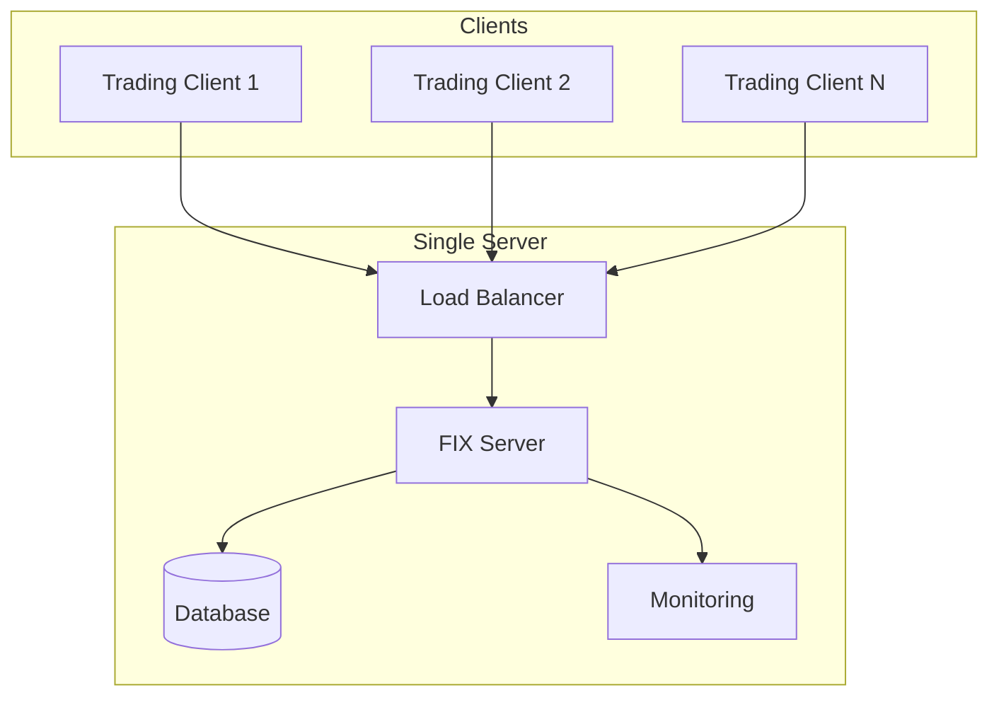
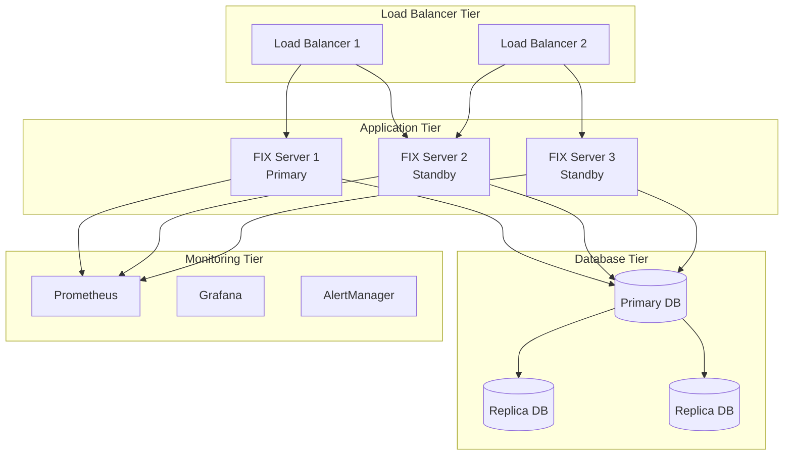
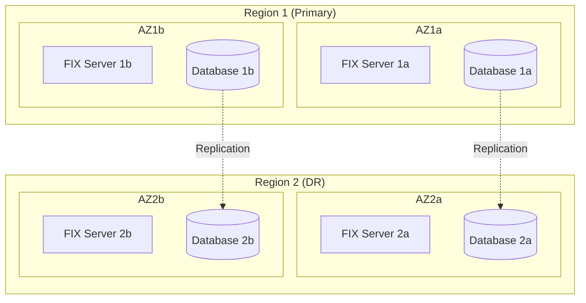

# FIX Server Deployment Guide

## 📋 Overview

This guide covers production deployment strategies for the FIX Server, including containerization, orchestration, monitoring, and best practices for high-availability trading environments.

## 🎯 Deployment Architectures

### 1. Single Instance Deployment

Suitable for development, testing, and small-scale production environments.



### 2. High-Availability Deployment

Recommended for production trading environments requiring 99.9%+ uptime.



### 3. Multi-Region Deployment

For global trading operations with disaster recovery requirements.



## 🐳 Docker Deployment

### 1. Dockerfile

```dockerfile
FROM openjdk:11-jre-slim

# Install required packages
RUN apt-get update && apt-get install -y \
    curl \
    netcat \
    && rm -rf /var/lib/apt/lists/*

# Create application user
RUN groupadd -r fixserver && useradd -r -g fixserver fixserver

# Set working directory
WORKDIR /app

# Copy application JAR
COPY target/fix-server-*.jar fix-server.jar

# Copy configuration files
COPY src/main/resources/application*.yml ./
COPY scripts/ ./scripts/

# Set permissions
RUN chown -R fixserver:fixserver /app
RUN chmod +x scripts/*.sh

# Create logs directory
RUN mkdir -p logs && chown fixserver:fixserver logs

# Switch to application user
USER fixserver

# Health check
HEALTHCHECK --interval=30s --timeout=10s --start-period=60s --retries=3 \
    CMD curl -f http://localhost:8080/actuator/health || exit 1

# Expose ports
EXPOSE 8080 9878 9879

# Set JVM options for container
ENV JAVA_OPTS="-server -Xms2g -Xmx2g -XX:+UseG1GC -XX:MaxGCPauseMillis=10 -XX:+UseContainerSupport"

# Start application
ENTRYPOINT ["sh", "-c", "java $JAVA_OPTS -jar fix-server.jar"]
```

### 2. Multi-Stage Build

```dockerfile
# Build stage
FROM maven:3.8-openjdk-11 AS builder

WORKDIR /build

# Copy pom.xml and download dependencies
COPY pom.xml .
RUN mvn dependency:go-offline -B

# Copy source code and build
COPY src ./src
RUN mvn clean package -DskipTests

# Runtime stage
FROM openjdk:11-jre-slim

RUN groupadd -r fixserver && useradd -r -g fixserver fixserver

WORKDIR /app

# Copy JAR from build stage
COPY --from=builder /build/target/fix-server-*.jar fix-server.jar

# Copy configuration
COPY src/main/resources/application*.yml ./

RUN chown -R fixserver:fixserver /app
USER fixserver

EXPOSE 8080 9878 9879

ENV JAVA_OPTS="-server -Xms2g -Xmx2g -XX:+UseG1GC -XX:MaxGCPauseMillis=10"

ENTRYPOINT ["sh", "-c", "java $JAVA_OPTS -jar fix-server.jar"]
```

### 3. Docker Compose

#### Development Environment
```yaml
version: '3.8'

services:
  fix-server:
    build: .
    ports:
      - "8080:8080"
      - "9878:9878"
      - "9879:9879"
    environment:
      - SPRING_PROFILES_ACTIVE=dev
      - JAVA_OPTS=-Xms1g -Xmx2g -XX:+UseG1GC
    volumes:
      - ./logs:/app/logs
      - ./config:/app/config
    depends_on:
      - postgres
    restart: unless-stopped

  postgres:
    image: postgres:13
    environment:
      - POSTGRES_DB=fixserver
      - POSTGRES_USER=fixserver
      - POSTGRES_PASSWORD=fixserver_dev
    volumes:
      - postgres_data:/var/lib/postgresql/data
      - ./init.sql:/docker-entrypoint-initdb.d/init.sql
    ports:
      - "5432:5432"
    restart: unless-stopped

  prometheus:
    image: prom/prometheus:latest
    ports:
      - "9090:9090"
    volumes:
      - ./monitoring/prometheus.yml:/etc/prometheus/prometheus.yml
      - prometheus_data:/prometheus
    command:
      - '--config.file=/etc/prometheus/prometheus.yml'
      - '--storage.tsdb.path=/prometheus'
      - '--web.console.libraries=/etc/prometheus/console_libraries'
      - '--web.console.templates=/etc/prometheus/consoles'
    restart: unless-stopped

  grafana:
    image: grafana/grafana:latest
    ports:
      - "3000:3000"
    environment:
      - GF_SECURITY_ADMIN_PASSWORD=admin
    volumes:
      - grafana_data:/var/lib/grafana
      - ./monitoring/grafana/dashboards:/etc/grafana/provisioning/dashboards
      - ./monitoring/grafana/datasources:/etc/grafana/provisioning/datasources
    restart: unless-stopped

volumes:
  postgres_data:
  prometheus_data:
  grafana_data:
```

#### Production Environment
```yaml
version: '3.8'

services:
  fix-server:
    image: fix-server:${VERSION:-latest}
    ports:
      - "8080:8080"
      - "9878:9878"
      - "9879:9879"
    environment:
      - SPRING_PROFILES_ACTIVE=prod
      - DB_HOST=${DB_HOST}
      - DB_PASSWORD=${DB_PASSWORD}
      - ADMIN_PASSWORD=${ADMIN_PASSWORD}
      - JAVA_OPTS=-server -Xms4g -Xmx4g -XX:+UseG1GC -XX:MaxGCPauseMillis=10
    volumes:
      - /opt/fix-server/logs:/app/logs
      - /opt/fix-server/config:/app/config
    deploy:
      replicas: 2
      resources:
        limits:
          cpus: '4'
          memory: 8G
        reservations:
          cpus: '2'
          memory: 4G
      restart_policy:
        condition: on-failure
        delay: 10s
        max_attempts: 3
    healthcheck:
      test: ["CMD", "curl", "-f", "http://localhost:8080/actuator/health"]
      interval: 30s
      timeout: 10s
      retries: 3
      start_period: 60s
    logging:
      driver: "json-file"
      options:
        max-size: "100m"
        max-file: "5"

  nginx:
    image: nginx:alpine
    ports:
      - "80:80"
      - "443:443"
    volumes:
      - ./nginx/nginx.conf:/etc/nginx/nginx.conf
      - ./nginx/ssl:/etc/nginx/ssl
    depends_on:
      - fix-server
    restart: unless-stopped
```

## ☸️ Kubernetes Deployment

### 1. Namespace and ConfigMap

```yaml
# namespace.yaml
apiVersion: v1
kind: Namespace
metadata:
  name: fix-server
  labels:
    name: fix-server

---
# configmap.yaml
apiVersion: v1
kind: ConfigMap
metadata:
  name: fix-server-config
  namespace: fix-server
data:
  application.yml: |
    server:
      port: 8080
    fix:
      server:
        port: 9878
        netty:
          port: 9879
          worker-threads: 16
          max-connections: 50000
        performance:
          enabled: true
          use-optimized-parser: true
          use-async-storage: true
    spring:
      profiles:
        active: prod
      datasource:
        url: jdbc:postgresql://postgres-service:5432/fixserver
        username: fixserver
        password: ${DB_PASSWORD}
    management:
      endpoints:
        web:
          exposure:
            include: health,info,metrics,prometheus
```

### 2. Secrets

```yaml
# secrets.yaml
apiVersion: v1
kind: Secret
metadata:
  name: fix-server-secrets
  namespace: fix-server
type: Opaque
data:
  db-password: <base64-encoded-password>
  admin-password: <base64-encoded-password>
  keystore-password: <base64-encoded-password>
```

### 3. Deployment

```yaml
# deployment.yaml
apiVersion: apps/v1
kind: Deployment
metadata:
  name: fix-server
  namespace: fix-server
  labels:
    app: fix-server
spec:
  replicas: 3
  strategy:
    type: RollingUpdate
    rollingUpdate:
      maxSurge: 1
      maxUnavailable: 0
  selector:
    matchLabels:
      app: fix-server
  template:
    metadata:
      labels:
        app: fix-server
      annotations:
        prometheus.io/scrape: "true"
        prometheus.io/port: "8080"
        prometheus.io/path: "/actuator/prometheus"
    spec:
      containers:
      - name: fix-server
        image: fix-server:1.0.0
        ports:
        - containerPort: 8080
          name: management
        - containerPort: 9878
          name: fix-traditional
        - containerPort: 9879
          name: fix-netty
        env:
        - name: SPRING_PROFILES_ACTIVE
          value: "prod"
        - name: DB_PASSWORD
          valueFrom:
            secretKeyRef:
              name: fix-server-secrets
              key: db-password
        - name: ADMIN_PASSWORD
          valueFrom:
            secretKeyRef:
              name: fix-server-secrets
              key: admin-password
        - name: JAVA_OPTS
          value: "-server -Xms4g -Xmx4g -XX:+UseG1GC -XX:MaxGCPauseMillis=10 -XX:+UseContainerSupport"
        volumeMounts:
        - name: config
          mountPath: /app/config
        - name: logs
          mountPath: /app/logs
        resources:
          requests:
            memory: "4Gi"
            cpu: "2"
          limits:
            memory: "8Gi"
            cpu: "4"
        livenessProbe:
          httpGet:
            path: /actuator/health
            port: 8080
          initialDelaySeconds: 60
          periodSeconds: 30
          timeoutSeconds: 10
          failureThreshold: 3
        readinessProbe:
          httpGet:
            path: /actuator/health
            port: 8080
          initialDelaySeconds: 30
          periodSeconds: 10
          timeoutSeconds: 5
          failureThreshold: 3
        startupProbe:
          httpGet:
            path: /actuator/health
            port: 8080
          initialDelaySeconds: 30
          periodSeconds: 10
          timeoutSeconds: 5
          failureThreshold: 10
      volumes:
      - name: config
        configMap:
          name: fix-server-config
      - name: logs
        emptyDir: {}
      affinity:
        podAntiAffinity:
          preferredDuringSchedulingIgnoredDuringExecution:
          - weight: 100
            podAffinityTerm:
              labelSelector:
                matchExpressions:
                - key: app
                  operator: In
                  values:
                  - fix-server
              topologyKey: kubernetes.io/hostname
```

### 4. Services

```yaml
# service.yaml
apiVersion: v1
kind: Service
metadata:
  name: fix-server-service
  namespace: fix-server
  labels:
    app: fix-server
spec:
  type: ClusterIP
  ports:
  - port: 8080
    targetPort: 8080
    name: management
  - port: 9878
    targetPort: 9878
    name: fix-traditional
  - port: 9879
    targetPort: 9879
    name: fix-netty
  selector:
    app: fix-server

---
# Load balancer for external access
apiVersion: v1
kind: Service
metadata:
  name: fix-server-lb
  namespace: fix-server
  labels:
    app: fix-server
spec:
  type: LoadBalancer
  ports:
  - port: 9878
    targetPort: 9878
    name: fix-traditional
  - port: 9879
    targetPort: 9879
    name: fix-netty
  selector:
    app: fix-server
```

### 5. Ingress

```yaml
# ingress.yaml
apiVersion: networking.k8s.io/v1
kind: Ingress
metadata:
  name: fix-server-ingress
  namespace: fix-server
  annotations:
    kubernetes.io/ingress.class: nginx
    nginx.ingress.kubernetes.io/ssl-redirect: "true"
    nginx.ingress.kubernetes.io/backend-protocol: "HTTP"
    cert-manager.io/cluster-issuer: "letsencrypt-prod"
spec:
  tls:
  - hosts:
    - fix-server.example.com
    secretName: fix-server-tls
  rules:
  - host: fix-server.example.com
    http:
      paths:
      - path: /
        pathType: Prefix
        backend:
          service:
            name: fix-server-service
            port:
              number: 8080
```

### 6. Horizontal Pod Autoscaler

```yaml
# hpa.yaml
apiVersion: autoscaling/v2
kind: HorizontalPodAutoscaler
metadata:
  name: fix-server-hpa
  namespace: fix-server
spec:
  scaleTargetRef:
    apiVersion: apps/v1
    kind: Deployment
    name: fix-server
  minReplicas: 3
  maxReplicas: 10
  metrics:
  - type: Resource
    resource:
      name: cpu
      target:
        type: Utilization
        averageUtilization: 70
  - type: Resource
    resource:
      name: memory
      target:
        type: Utilization
        averageUtilization: 80
  behavior:
    scaleDown:
      stabilizationWindowSeconds: 300
      policies:
      - type: Percent
        value: 10
        periodSeconds: 60
    scaleUp:
      stabilizationWindowSeconds: 60
      policies:
      - type: Percent
        value: 50
        periodSeconds: 60
```

## 🔧 Infrastructure Configuration

### 1. Load Balancer Configuration (NGINX)

```nginx
# nginx.conf
upstream fix_servers {
    least_conn;
    server fix-server-1:9878 max_fails=3 fail_timeout=30s;
    server fix-server-2:9878 max_fails=3 fail_timeout=30s;
    server fix-server-3:9878 max_fails=3 fail_timeout=30s;
}

upstream fix_netty_servers {
    least_conn;
    server fix-server-1:9879 max_fails=3 fail_timeout=30s;
    server fix-server-2:9879 max_fails=3 fail_timeout=30s;
    server fix-server-3:9879 max_fails=3 fail_timeout=30s;
}

server {
    listen 9878;
    proxy_pass fix_servers;
    proxy_timeout 1s;
    proxy_responses 1;
    error_log /var/log/nginx/fix_traditional.log;
}

server {
    listen 9879;
    proxy_pass fix_netty_servers;
    proxy_timeout 1s;
    proxy_responses 1;
    error_log /var/log/nginx/fix_netty.log;
}

# Management interface
server {
    listen 80;
    server_name fix-server.example.com;
    
    location / {
        proxy_pass http://fix_servers:8080;
        proxy_set_header Host $host;
        proxy_set_header X-Real-IP $remote_addr;
        proxy_set_header X-Forwarded-For $proxy_add_x_forwarded_for;
        proxy_set_header X-Forwarded-Proto $scheme;
    }
    
    location /actuator/health {
        proxy_pass http://fix_servers:8080/actuator/health;
        access_log off;
    }
}
```

### 2. Database Configuration

#### PostgreSQL High Availability
```yaml
# postgresql-ha.yaml
apiVersion: postgresql.cnpg.io/v1
kind: Cluster
metadata:
  name: postgres-cluster
  namespace: fix-server
spec:
  instances: 3
  
  postgresql:
    parameters:
      max_connections: "200"
      shared_buffers: "2GB"
      effective_cache_size: "6GB"
      work_mem: "256MB"
      maintenance_work_mem: "1GB"
      checkpoint_completion_target: "0.9"
      wal_buffers: "64MB"
      default_statistics_target: "100"
      random_page_cost: "1.1"
      effective_io_concurrency: "200"
  
  bootstrap:
    initdb:
      database: fixserver
      owner: fixserver
      secret:
        name: postgres-credentials
  
  storage:
    size: 100Gi
    storageClass: fast-ssd
  
  monitoring:
    enabled: true
  
  backup:
    retentionPolicy: "30d"
    barmanObjectStore:
      destinationPath: "s3://fix-server-backups/postgres"
      s3Credentials:
        accessKeyId:
          name: backup-credentials
          key: ACCESS_KEY_ID
        secretAccessKey:
          name: backup-credentials
          key: SECRET_ACCESS_KEY
```

### 3. Monitoring Stack

#### Prometheus Configuration
```yaml
# prometheus.yml
global:
  scrape_interval: 15s
  evaluation_interval: 15s

rule_files:
  - "fix_server_rules.yml"

scrape_configs:
  - job_name: 'fix-server'
    static_configs:
      - targets: ['fix-server-service:8080']
    metrics_path: '/actuator/prometheus'
    scrape_interval: 5s
    
  - job_name: 'kubernetes-pods'
    kubernetes_sd_configs:
      - role: pod
    relabel_configs:
      - source_labels: [__meta_kubernetes_pod_annotation_prometheus_io_scrape]
        action: keep
        regex: true
      - source_labels: [__meta_kubernetes_pod_annotation_prometheus_io_path]
        action: replace
        target_label: __metrics_path__
        regex: (.+)

alerting:
  alertmanagers:
    - static_configs:
        - targets:
          - alertmanager:9093
```

#### Alert Rules
```yaml
# fix_server_rules.yml
groups:
  - name: fix_server_alerts
    rules:
      - alert: FIXServerDown
        expr: up{job="fix-server"} == 0
        for: 30s
        labels:
          severity: critical
        annotations:
          summary: "FIX Server is down"
          description: "FIX Server {{ $labels.instance }} has been down for more than 30 seconds"
      
      - alert: HighLatency
        expr: histogram_quantile(0.95, fix_server_message_processing_time_seconds_bucket) > 0.001
        for: 2m
        labels:
          severity: warning
        annotations:
          summary: "High message processing latency"
          description: "95th percentile latency is {{ $value }}s"
      
      - alert: LowThroughput
        expr: rate(fix_server_messages_processed_total[5m]) < 1000
        for: 5m
        labels:
          severity: warning
        annotations:
          summary: "Low message throughput"
          description: "Message processing rate is {{ $value }} msg/sec"
      
      - alert: HighMemoryUsage
        expr: (process_resident_memory_bytes / process_virtual_memory_max_bytes) > 0.9
        for: 5m
        labels:
          severity: warning
        annotations:
          summary: "High memory usage"
          description: "Memory usage is {{ $value | humanizePercentage }}"
```

## 🔒 Security Configuration

### 1. TLS/SSL Configuration

```yaml
# tls-secret.yaml
apiVersion: v1
kind: Secret
metadata:
  name: fix-server-tls
  namespace: fix-server
type: kubernetes.io/tls
data:
  tls.crt: <base64-encoded-certificate>
  tls.key: <base64-encoded-private-key>
```

### 2. Network Policies

```yaml
# network-policy.yaml
apiVersion: networking.k8s.io/v1
kind: NetworkPolicy
metadata:
  name: fix-server-network-policy
  namespace: fix-server
spec:
  podSelector:
    matchLabels:
      app: fix-server
  policyTypes:
  - Ingress
  - Egress
  ingress:
  - from:
    - namespaceSelector:
        matchLabels:
          name: trading-clients
    ports:
    - protocol: TCP
      port: 9878
    - protocol: TCP
      port: 9879
  - from:
    - namespaceSelector:
        matchLabels:
          name: monitoring
    ports:
    - protocol: TCP
      port: 8080
  egress:
  - to:
    - namespaceSelector:
        matchLabels:
          name: database
    ports:
    - protocol: TCP
      port: 5432
  - to: []
    ports:
    - protocol: TCP
      port: 53
    - protocol: UDP
      port: 53
```

### 3. Pod Security Policy

```yaml
# pod-security-policy.yaml
apiVersion: policy/v1beta1
kind: PodSecurityPolicy
metadata:
  name: fix-server-psp
spec:
  privileged: false
  allowPrivilegeEscalation: false
  requiredDropCapabilities:
    - ALL
  volumes:
    - 'configMap'
    - 'emptyDir'
    - 'projected'
    - 'secret'
    - 'downwardAPI'
    - 'persistentVolumeClaim'
  runAsUser:
    rule: 'MustRunAsNonRoot'
  seLinux:
    rule: 'RunAsAny'
  fsGroup:
    rule: 'RunAsAny'
```

## 📊 Deployment Validation

### 1. Health Checks

```bash
#!/bin/bash
# deployment-validation.sh

echo "🔍 Validating FIX Server Deployment..."

# Check pod status
echo "📋 Checking pod status..."
kubectl get pods -n fix-server -l app=fix-server

# Check service endpoints
echo "🌐 Checking service endpoints..."
kubectl get endpoints -n fix-server

# Health check
echo "❤️ Performing health checks..."
for pod in $(kubectl get pods -n fix-server -l app=fix-server -o jsonpath='{.items[*].metadata.name}'); do
    echo "Checking pod: $pod"
    kubectl exec -n fix-server $pod -- curl -f http://localhost:8080/actuator/health
done

# Port connectivity test
echo "🔌 Testing port connectivity..."
kubectl run test-client --rm -i --tty --image=busybox -- /bin/sh -c "
    nc -zv fix-server-service 9878 &&
    nc -zv fix-server-service 9879 &&
    echo 'All ports accessible'
"

# Performance test
echo "⚡ Running performance test..."
kubectl run perf-test --rm -i --tty --image=fix-client:latest -- /bin/sh -c "
    java -jar fix-client.jar --host=fix-server-service --port=9879 --messages=1000 --concurrent=10
"

echo "✅ Deployment validation complete"
```

### 2. Load Testing

```bash
#!/bin/bash
# load-test.sh

echo "🚀 Starting load test..."

# Deploy load test clients
kubectl apply -f - <<EOF
apiVersion: batch/v1
kind: Job
metadata:
  name: fix-load-test
  namespace: fix-server
spec:
  parallelism: 10
  completions: 10
  template:
    spec:
      containers:
      - name: load-test
        image: fix-client:latest
        command: ["java"]
        args: [
          "-jar", "fix-client.jar",
          "--host=fix-server-service",
          "--port=9879",
          "--messages=10000",
          "--duration=300s",
          "--rate=1000"
        ]
        resources:
          requests:
            memory: "512Mi"
            cpu: "500m"
          limits:
            memory: "1Gi"
            cpu: "1"
      restartPolicy: Never
  backoffLimit: 3
EOF

# Monitor load test
echo "📊 Monitoring load test progress..."
kubectl logs -n fix-server -l job-name=fix-load-test -f

# Check server metrics during load test
echo "📈 Checking server metrics..."
kubectl exec -n fix-server deployment/fix-server -- curl -s http://localhost:8080/actuator/metrics/fix.server.messages.processing.time

echo "✅ Load test complete"
```

## 🔄 CI/CD Pipeline

### 1. GitLab CI/CD

```yaml
# .gitlab-ci.yml
stages:
  - build
  - test
  - security
  - package
  - deploy-staging
  - deploy-production

variables:
  DOCKER_REGISTRY: registry.example.com
  IMAGE_NAME: fix-server
  KUBECONFIG: /tmp/kubeconfig

build:
  stage: build
  image: maven:3.8-openjdk-11
  script:
    - mvn clean compile
  artifacts:
    paths:
      - target/
    expire_in: 1 hour

test:
  stage: test
  image: maven:3.8-openjdk-11
  script:
    - mvn test
    - mvn jacoco:report
  artifacts:
    reports:
      junit: target/surefire-reports/TEST-*.xml
      coverage_report:
        coverage_format: jacoco
        path: target/site/jacoco/jacoco.xml

security-scan:
  stage: security
  image: owasp/dependency-check:latest
  script:
    - dependency-check --project fix-server --scan target/ --format ALL
  artifacts:
    reports:
      dependency_scanning: dependency-check-report.json

package:
  stage: package
  image: docker:latest
  services:
    - docker:dind
  script:
    - mvn package -DskipTests
    - docker build -t $DOCKER_REGISTRY/$IMAGE_NAME:$CI_COMMIT_SHA .
    - docker push $DOCKER_REGISTRY/$IMAGE_NAME:$CI_COMMIT_SHA
    - docker tag $DOCKER_REGISTRY/$IMAGE_NAME:$CI_COMMIT_SHA $DOCKER_REGISTRY/$IMAGE_NAME:latest
    - docker push $DOCKER_REGISTRY/$IMAGE_NAME:latest

deploy-staging:
  stage: deploy-staging
  image: bitnami/kubectl:latest
  script:
    - echo $KUBE_CONFIG | base64 -d > $KUBECONFIG
    - kubectl set image deployment/fix-server fix-server=$DOCKER_REGISTRY/$IMAGE_NAME:$CI_COMMIT_SHA -n fix-server-staging
    - kubectl rollout status deployment/fix-server -n fix-server-staging --timeout=300s
    - ./scripts/deployment-validation.sh fix-server-staging
  environment:
    name: staging
    url: https://fix-server-staging.example.com
  only:
    - develop

deploy-production:
  stage: deploy-production
  image: bitnami/kubectl:latest
  script:
    - echo $KUBE_CONFIG | base64 -d > $KUBECONFIG
    - kubectl set image deployment/fix-server fix-server=$DOCKER_REGISTRY/$IMAGE_NAME:$CI_COMMIT_SHA -n fix-server
    - kubectl rollout status deployment/fix-server -n fix-server --timeout=600s
    - ./scripts/deployment-validation.sh fix-server
  environment:
    name: production
    url: https://fix-server.example.com
  when: manual
  only:
    - main
```

### 2. GitHub Actions

```yaml
# .github/workflows/deploy.yml
name: Deploy FIX Server

on:
  push:
    branches: [main, develop]
  pull_request:
    branches: [main]

env:
  REGISTRY: ghcr.io
  IMAGE_NAME: ${{ github.repository }}

jobs:
  build-and-test:
    runs-on: ubuntu-latest
    steps:
      - uses: actions/checkout@v3
      
      - name: Set up JDK 11
        uses: actions/setup-java@v3
        with:
          java-version: '11'
          distribution: 'temurin'
      
      - name: Cache Maven dependencies
        uses: actions/cache@v3
        with:
          path: ~/.m2
          key: ${{ runner.os }}-m2-${{ hashFiles('**/pom.xml') }}
      
      - name: Run tests
        run: mvn clean test
      
      - name: Generate test report
        uses: dorny/test-reporter@v1
        if: success() || failure()
        with:
          name: Maven Tests
          path: target/surefire-reports/*.xml
          reporter: java-junit

  security-scan:
    runs-on: ubuntu-latest
    steps:
      - uses: actions/checkout@v3
      
      - name: Run Trivy vulnerability scanner
        uses: aquasecurity/trivy-action@master
        with:
          scan-type: 'fs'
          scan-ref: '.'
          format: 'sarif'
          output: 'trivy-results.sarif'
      
      - name: Upload Trivy scan results
        uses: github/codeql-action/upload-sarif@v2
        with:
          sarif_file: 'trivy-results.sarif'

  build-and-push:
    needs: [build-and-test, security-scan]
    runs-on: ubuntu-latest
    permissions:
      contents: read
      packages: write
    steps:
      - uses: actions/checkout@v3
      
      - name: Log in to Container Registry
        uses: docker/login-action@v2
        with:
          registry: ${{ env.REGISTRY }}
          username: ${{ github.actor }}
          password: ${{ secrets.GITHUB_TOKEN }}
      
      - name: Extract metadata
        id: meta
        uses: docker/metadata-action@v4
        with:
          images: ${{ env.REGISTRY }}/${{ env.IMAGE_NAME }}
          tags: |
            type=ref,event=branch
            type=ref,event=pr
            type=sha
      
      - name: Build and push Docker image
        uses: docker/build-push-action@v4
        with:
          context: .
          push: true
          tags: ${{ steps.meta.outputs.tags }}
          labels: ${{ steps.meta.outputs.labels }}

  deploy-staging:
    if: github.ref == 'refs/heads/develop'
    needs: build-and-push
    runs-on: ubuntu-latest
    environment: staging
    steps:
      - uses: actions/checkout@v3
      
      - name: Deploy to staging
        run: |
          echo "Deploying to staging environment"
          # Add deployment commands here

  deploy-production:
    if: github.ref == 'refs/heads/main'
    needs: build-and-push
    runs-on: ubuntu-latest
    environment: production
    steps:
      - uses: actions/checkout@v3
      
      - name: Deploy to production
        run: |
          echo "Deploying to production environment"
          # Add deployment commands here
```

## 📚 Best Practices

### 1. Deployment Best Practices
- Use immutable infrastructure patterns
- Implement blue-green or canary deployments
- Automate rollback procedures
- Maintain deployment documentation
- Use infrastructure as code (IaC)

### 2. Security Best Practices
- Run containers as non-root users
- Use minimal base images
- Implement network segmentation
- Regular security scanning
- Rotate secrets and certificates

### 3. Monitoring Best Practices
- Implement comprehensive health checks
- Monitor business metrics, not just technical metrics
- Set up alerting for critical issues
- Use distributed tracing for complex scenarios
- Regular performance testing

### 4. Operational Best Practices
- Implement proper logging and log aggregation
- Use configuration management
- Automate backup and recovery procedures
- Document runbooks and procedures
- Regular disaster recovery testing

## 📚 Additional Resources

- **[Monitoring Guide](MONITORING.md)** - Production monitoring setup
- **[Security Guide](SECURITY.md)** - Security configuration details
- **[Performance Guide](../performance/PERFORMANCE_GUIDE.md)** - Performance optimization
- **[Kubernetes Documentation](https://kubernetes.io/docs/)**
- **[Docker Best Practices](https://docs.docker.com/develop/dev-best-practices/)**