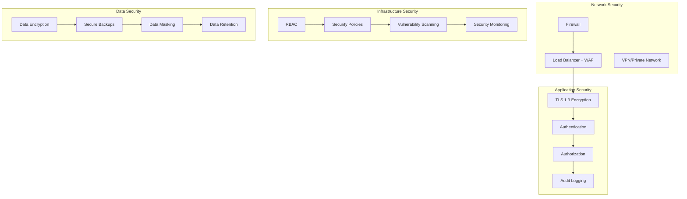

# FIX Server Security Guide

## 📋 Overview

This guide covers comprehensive security configuration and best practices for the FIX Server in production environments. Financial trading systems require the highest levels of security to protect sensitive trading data and ensure regulatory compliance.

## 🔒 Security Architecture

### Multi-Layer Security Model



## 🔐 Authentication and Authorization

### 1. FIX Session Authentication

#### Basic Authentication Configuration
```yaml
# application-security.yml
fix:
  security:
    authentication:
      enabled: true
      type: database  # Options: simple, database, ldap, oauth2
      session-timeout: 3600  # 1 hour
      max-failed-attempts: 3
      lockout-duration: 900   # 15 minutes
      
    authorization:
      enabled: true
      default-role: TRADER
      roles:
        ADMIN:
          permissions: [READ, WRITE, ADMIN, CANCEL_ALL]
        TRADER:
          permissions: [READ, WRITE, CANCEL_OWN]
        VIEWER:
          permissions: [READ]
```

#### Database Authentication
```java
@Entity
@Table(name = "fix_users")
public class FIXUser {
    @Id
    private String compId;
    
    @Column(nullable = false)
    private String passwordHash;
    
    @Column(nullable = false)
    private String salt;
    
    @Enumerated(EnumType.STRING)
    private UserRole role;
    
    @Column
    private boolean enabled = true;
    
    @Column
    private LocalDateTime lastLogin;
    
    @Column
    private int failedAttempts = 0;
    
    @Column
    private LocalDateTime lockedUntil;
    
    // Getters and setters
}

@Component
public class DatabaseAuthenticationProvider implements FIXAuthenticationProvider {
    
    @Autowired
    private FIXUserRepository userRepository;
    
    @Autowired
    private PasswordEncoder passwordEncoder;
    
    @Override
    public AuthenticationResult authenticate(String compId, String password) {
        FIXUser user = userRepository.findByCompId(compId);
        
        if (user == null || !user.isEnabled()) {
            return AuthenticationResult.failure("Invalid credentials");
        }
        
        if (user.isLocked()) {
            return AuthenticationResult.failure("Account locked");
        }
        
        if (!passwordEncoder.matches(password, user.getPasswordHash())) {
            handleFailedAttempt(user);
            return AuthenticationResult.failure("Invalid credentials");
        }
        
        handleSuccessfulLogin(user);
        return AuthenticationResult.success(user);
    }
    
    private void handleFailedAttempt(FIXUser user) {
        user.setFailedAttempts(user.getFailedAttempts() + 1);
        
        if (user.getFailedAttempts() >= 3) {
            user.setLockedUntil(LocalDateTime.now().plusMinutes(15));
        }
        
        userRepository.save(user);
    }
    
    private void handleSuccessfulLogin(FIXUser user) {
        user.setLastLogin(LocalDateTime.now());
        user.setFailedAttempts(0);
        user.setLockedUntil(null);
        userRepository.save(user);
    }
}
```

#### LDAP Authentication
```yaml
spring:
  ldap:
    urls: ldap://ldap.company.com:389
    base: dc=company,dc=com
    username: cn=admin,dc=company,dc=com
    password: ${LDAP_PASSWORD}
    
fix:
  security:
    ldap:
      user-search-base: ou=users
      user-search-filter: (uid={0})
      group-search-base: ou=groups
      group-search-filter: member={0}
      role-mapping:
        TRADERS: TRADER
        ADMINS: ADMIN
        VIEWERS: VIEWER
```

### 2. Management Interface Security

#### Spring Security Configuration
```java
@Configuration
@EnableWebSecurity
@EnableGlobalMethodSecurity(prePostEnabled = true)
public class SecurityConfig {
    
    @Bean
    public SecurityFilterChain filterChain(HttpSecurity http) throws Exception {
        http
            .authorizeHttpRequests(authz -> authz
                .requestMatchers("/actuator/health").permitAll()
                .requestMatchers("/actuator/info").permitAll()
                .requestMatchers("/actuator/**").hasRole("ADMIN")
                .requestMatchers("/api/admin/**").hasRole("ADMIN")
                .requestMatchers("/api/**").hasAnyRole("ADMIN", "TRADER")
                .anyRequest().authenticated()
            )
            .httpBasic(Customizer.withDefaults())
            .sessionManagement(session -> session
                .sessionCreationPolicy(SessionCreationPolicy.STATELESS)
            )
            .csrf(csrf -> csrf.disable())
            .headers(headers -> headers
                .frameOptions().deny()
                .contentTypeOptions(Customizer.withDefaults())
                .httpStrictTransportSecurity(hsts -> hsts
                    .maxAgeInSeconds(31536000)
                    .includeSubdomains(true)
                )
            );
        
        return http.build();
    }
    
    @Bean
    public PasswordEncoder passwordEncoder() {
        return new BCryptPasswordEncoder(12);
    }
    
    @Bean
    public AuthenticationManager authenticationManager(
            AuthenticationConfiguration config) throws Exception {
        return config.getAuthenticationManager();
    }
}
```

#### JWT Token Authentication
```java
@Component
public class JwtTokenProvider {
    
    @Value("${fix.security.jwt.secret}")
    private String jwtSecret;
    
    @Value("${fix.security.jwt.expiration:3600}")
    private int jwtExpirationInSeconds;
    
    public String generateToken(Authentication authentication) {
        UserPrincipal userPrincipal = (UserPrincipal) authentication.getPrincipal();
        Date expiryDate = new Date(System.currentTimeMillis() + jwtExpirationInSeconds * 1000);
        
        return Jwts.builder()
                .setSubject(userPrincipal.getUsername())
                .setIssuedAt(new Date())
                .setExpiration(expiryDate)
                .signWith(SignatureAlgorithm.HS512, jwtSecret)
                .compact();
    }
    
    public String getUsernameFromToken(String token) {
        Claims claims = Jwts.parser()
                .setSigningKey(jwtSecret)
                .parseClaimsJws(token)
                .getBody();
        
        return claims.getSubject();
    }
    
    public boolean validateToken(String authToken) {
        try {
            Jwts.parser().setSigningKey(jwtSecret).parseClaimsJws(authToken);
            return true;
        } catch (SignatureException ex) {
            logger.error("Invalid JWT signature");
        } catch (MalformedJwtException ex) {
            logger.error("Invalid JWT token");
        } catch (ExpiredJwtException ex) {
            logger.error("Expired JWT token");
        } catch (UnsupportedJwtException ex) {
            logger.error("Unsupported JWT token");
        } catch (IllegalArgumentException ex) {
            logger.error("JWT claims string is empty");
        }
        return false;
    }
}
```

## 🔒 TLS/SSL Configuration

### 1. Certificate Management

#### Generate Self-Signed Certificate (Development)
```bash
# Generate private key
openssl genrsa -out fix-server.key 2048

# Generate certificate signing request
openssl req -new -key fix-server.key -out fix-server.csr \
    -subj "/C=US/ST=NY/L=NYC/O=Company/CN=fix-server.company.com"

# Generate self-signed certificate
openssl x509 -req -days 365 -in fix-server.csr \
    -signkey fix-server.key -out fix-server.crt

# Create PKCS12 keystore
openssl pkcs12 -export -in fix-server.crt -inkey fix-server.key \
    -out fix-server.p12 -name fix-server -passout pass:changeit
```

#### Production Certificate (Let's Encrypt)
```bash
# Install certbot
sudo apt-get install certbot

# Generate certificate
sudo certbot certonly --standalone \
    -d fix-server.company.com \
    --email admin@company.com \
    --agree-tos

# Convert to PKCS12
sudo openssl pkcs12 -export \
    -in /etc/letsencrypt/live/fix-server.company.com/fullchain.pem \
    -inkey /etc/letsencrypt/live/fix-server.company.com/privkey.pem \
    -out /opt/fix-server/ssl/fix-server.p12 \
    -name fix-server
```

### 2. TLS Configuration

#### Application Configuration
```yaml
# application-ssl.yml
server:
  ssl:
    enabled: true
    key-store: classpath:ssl/fix-server.p12
    key-store-password: ${KEYSTORE_PASSWORD}
    key-store-type: PKCS12
    key-alias: fix-server
    
    # TLS version and cipher configuration
    protocol: TLS
    enabled-protocols: TLSv1.2,TLSv1.3
    ciphers: 
      - TLS_AES_256_GCM_SHA384
      - TLS_AES_128_GCM_SHA256
      - TLS_ECDHE_RSA_WITH_AES_256_GCM_SHA384
      - TLS_ECDHE_RSA_WITH_AES_128_GCM_SHA256
    
    # Client certificate authentication
    client-auth: need  # Options: none, want, need
    trust-store: classpath:ssl/truststore.p12
    trust-store-password: ${TRUSTSTORE_PASSWORD}
    trust-store-type: PKCS12

fix:
  server:
    ssl:
      enabled: true
      key-store: classpath:ssl/fix-server.p12
      key-store-password: ${KEYSTORE_PASSWORD}
      trust-store: classpath:ssl/truststore.p12
      trust-store-password: ${TRUSTSTORE_PASSWORD}
      client-auth: true
      protocols: [TLSv1.2, TLSv1.3]
```

#### Netty SSL Configuration
```java
@Configuration
public class NettySSLConfig {
    
    @Value("${fix.server.ssl.key-store}")
    private String keyStorePath;
    
    @Value("${fix.server.ssl.key-store-password}")
    private String keyStorePassword;
    
    @Bean
    public SslContext sslContext() throws Exception {
        KeyStore keyStore = KeyStore.getInstance("PKCS12");
        try (InputStream keyStoreStream = getClass().getResourceAsStream(keyStorePath)) {
            keyStore.load(keyStoreStream, keyStorePassword.toCharArray());
        }
        
        KeyManagerFactory keyManagerFactory = KeyManagerFactory.getInstance(
            KeyManagerFactory.getDefaultAlgorithm());
        keyManagerFactory.init(keyStore, keyStorePassword.toCharArray());
        
        return SslContextBuilder.forServer(keyManagerFactory)
            .protocols("TLSv1.2", "TLSv1.3")
            .ciphers(Arrays.asList(
                "TLS_AES_256_GCM_SHA384",
                "TLS_AES_128_GCM_SHA256",
                "TLS_ECDHE_RSA_WITH_AES_256_GCM_SHA384",
                "TLS_ECDHE_RSA_WITH_AES_128_GCM_SHA256"
            ))
            .clientAuth(ClientAuth.REQUIRE)
            .build();
    }
}
```

## 🛡️ Network Security

### 1. Firewall Configuration

#### iptables Rules
```bash
#!/bin/bash
# firewall-rules.sh

# Flush existing rules
iptables -F
iptables -X
iptables -t nat -F
iptables -t nat -X

# Default policies
iptables -P INPUT DROP
iptables -P FORWARD DROP
iptables -P OUTPUT ACCEPT

# Allow loopback
iptables -A INPUT -i lo -j ACCEPT
iptables -A OUTPUT -o lo -j ACCEPT

# Allow established connections
iptables -A INPUT -m state --state ESTABLISHED,RELATED -j ACCEPT

# SSH access (restrict to management network)
iptables -A INPUT -p tcp --dport 22 -s 10.0.1.0/24 -j ACCEPT

# FIX Server ports (restrict to trading network)
iptables -A INPUT -p tcp --dport 9878 -s 10.0.2.0/24 -j ACCEPT
iptables -A INPUT -p tcp --dport 9879 -s 10.0.2.0/24 -j ACCEPT

# Management interface (restrict to admin network)
iptables -A INPUT -p tcp --dport 8080 -s 10.0.1.0/24 -j ACCEPT

# Database access (internal only)
iptables -A INPUT -p tcp --dport 5432 -s 10.0.0.0/16 -j ACCEPT

# DNS
iptables -A INPUT -p udp --dport 53 -j ACCEPT
iptables -A INPUT -p tcp --dport 53 -j ACCEPT

# NTP
iptables -A INPUT -p udp --dport 123 -j ACCEPT

# Rate limiting for FIX ports
iptables -A INPUT -p tcp --dport 9878 -m limit --limit 1000/sec --limit-burst 2000 -j ACCEPT
iptables -A INPUT -p tcp --dport 9879 -m limit --limit 1000/sec --limit-burst 2000 -j ACCEPT

# Log dropped packets
iptables -A INPUT -j LOG --log-prefix "DROPPED: "

# Save rules
iptables-save > /etc/iptables/rules.v4
```

#### UFW Configuration (Ubuntu)
```bash
# Reset UFW
ufw --force reset

# Default policies
ufw default deny incoming
ufw default allow outgoing

# SSH (restrict to management network)
ufw allow from 10.0.1.0/24 to any port 22

# FIX Server ports (restrict to trading network)
ufw allow from 10.0.2.0/24 to any port 9878
ufw allow from 10.0.2.0/24 to any port 9879

# Management interface (restrict to admin network)
ufw allow from 10.0.1.0/24 to any port 8080

# Rate limiting
ufw limit 9878/tcp
ufw limit 9879/tcp

# Enable UFW
ufw --force enable
```

### 2. Network Segmentation

#### VLAN Configuration
```
# Trading Network VLAN
VLAN 100: 10.0.2.0/24 (Trading Clients)
- FIX Client connections
- Market data feeds
- Order management systems

# Management Network VLAN  
VLAN 200: 10.0.1.0/24 (Management)
- Administrative access
- Monitoring systems
- Backup systems

# Database Network VLAN
VLAN 300: 10.0.3.0/24 (Database)
- Database servers
- Internal services only
- No external access
```

#### Network ACLs
```
# Trading VLAN ACL
permit tcp 10.0.2.0/24 10.0.0.10 eq 9878
permit tcp 10.0.2.0/24 10.0.0.10 eq 9879
deny ip any any

# Management VLAN ACL  
permit tcp 10.0.1.0/24 10.0.0.10 eq 22
permit tcp 10.0.1.0/24 10.0.0.10 eq 8080
permit tcp 10.0.1.0/24 10.0.3.0/24 eq 5432
deny ip any any

# Database VLAN ACL
permit tcp 10.0.0.10 10.0.3.0/24 eq 5432
deny ip any any
```

## 🔍 Audit and Compliance

### 1. Audit Logging

#### Comprehensive Audit Configuration
```java
@Component
public class FIXAuditLogger {
    
    private static final Logger auditLogger = LoggerFactory.getLogger("AUDIT");
    
    @Autowired
    private AuditRepository auditRepository;
    
    public void logSessionEvent(String sessionId, String compId, AuditEvent event, String details) {
        AuditRecord record = AuditRecord.builder()
            .timestamp(Instant.now())
            .sessionId(sessionId)
            .compId(compId)
            .event(event)
            .details(details)
            .sourceIp(getCurrentSourceIp())
            .build();
        
        // Log to file
        auditLogger.info("SESSION_EVENT|{}|{}|{}|{}|{}", 
            record.getTimestamp(), sessionId, compId, event, details);
        
        // Store in database
        auditRepository.save(record);
    }
    
    public void logMessageEvent(String sessionId, String compId, FIXMessage message, 
                               MessageDirection direction, AuditEvent event) {
        AuditRecord record = AuditRecord.builder()
            .timestamp(Instant.now())
            .sessionId(sessionId)
            .compId(compId)
            .messageType(message.getMessageType())
            .direction(direction)
            .event(event)
            .messageContent(sanitizeMessage(message))
            .sourceIp(getCurrentSourceIp())
            .build();
        
        auditLogger.info("MESSAGE_EVENT|{}|{}|{}|{}|{}|{}", 
            record.getTimestamp(), sessionId, compId, 
            message.getMessageType(), direction, event);
        
        auditRepository.save(record);
    }
    
    public void logSecurityEvent(String compId, SecurityEvent event, String details) {
        SecurityAuditRecord record = SecurityAuditRecord.builder()
            .timestamp(Instant.now())
            .compId(compId)
            .event(event)
            .details(details)
            .sourceIp(getCurrentSourceIp())
            .userAgent(getCurrentUserAgent())
            .build();
        
        auditLogger.warn("SECURITY_EVENT|{}|{}|{}|{}", 
            record.getTimestamp(), compId, event, details);
        
        auditRepository.save(record);
    }
    
    private String sanitizeMessage(FIXMessage message) {
        // Remove sensitive fields for audit logging
        FIXMessage sanitized = message.copy();
        sanitized.removeField(FIXTags.PASSWORD);
        sanitized.removeField(FIXTags.NEW_PASSWORD);
        return sanitized.toFixString();
    }
}
```

#### Audit Event Types
```java
public enum AuditEvent {
    // Session events
    SESSION_LOGON,
    SESSION_LOGOUT,
    SESSION_TIMEOUT,
    SESSION_REJECTED,
    
    // Message events
    MESSAGE_RECEIVED,
    MESSAGE_SENT,
    MESSAGE_REJECTED,
    MESSAGE_REPLAYED,
    
    // Security events
    AUTHENTICATION_SUCCESS,
    AUTHENTICATION_FAILURE,
    AUTHORIZATION_FAILURE,
    ACCOUNT_LOCKED,
    PASSWORD_CHANGED,
    
    // Administrative events
    CONFIGURATION_CHANGED,
    USER_CREATED,
    USER_DELETED,
    ROLE_CHANGED
}

public enum SecurityEvent {
    LOGIN_SUCCESS,
    LOGIN_FAILURE,
    ACCOUNT_LOCKED,
    SUSPICIOUS_ACTIVITY,
    PRIVILEGE_ESCALATION,
    DATA_ACCESS_VIOLATION,
    CONFIGURATION_CHANGE,
    SECURITY_POLICY_VIOLATION
}
```

### 2. Compliance Features

#### SOX Compliance
```java
@Component
public class SOXComplianceManager {
    
    @Autowired
    private AuditRepository auditRepository;
    
    @Scheduled(cron = "0 0 2 * * ?") // Daily at 2 AM
    public void generateDailyComplianceReport() {
        LocalDate yesterday = LocalDate.now().minusDays(1);
        
        ComplianceReport report = ComplianceReport.builder()
            .reportDate(yesterday)
            .totalSessions(getTotalSessions(yesterday))
            .totalMessages(getTotalMessages(yesterday))
            .failedLogins(getFailedLogins(yesterday))
            .securityViolations(getSecurityViolations(yesterday))
            .dataIntegrityChecks(performDataIntegrityChecks(yesterday))
            .build();
        
        storeComplianceReport(report);
        notifyComplianceTeam(report);
    }
    
    public void performDataIntegrityCheck() {
        // Verify message sequence integrity
        List<String> sessions = auditRepository.findActiveSessions();
        
        for (String sessionId : sessions) {
            List<AuditRecord> messages = auditRepository.findMessagesBySession(sessionId);
            validateMessageSequence(sessionId, messages);
        }
    }
    
    private void validateMessageSequence(String sessionId, List<AuditRecord> messages) {
        int expectedSeqNum = 1;
        
        for (AuditRecord record : messages) {
            if (record.getSequenceNumber() != expectedSeqNum) {
                auditLogger.error("SEQUENCE_GAP|{}|Expected:{}, Actual:{}", 
                    sessionId, expectedSeqNum, record.getSequenceNumber());
            }
            expectedSeqNum++;
        }
    }
}
```

#### MiFID II Compliance
```java
@Component
public class MiFIDIIComplianceManager {
    
    @EventListener
    public void handleOrderEvent(OrderEvent event) {
        // Record order details for MiFID II reporting
        MiFIDRecord record = MiFIDRecord.builder()
            .timestamp(event.getTimestamp())
            .orderId(event.getOrderId())
            .clientId(event.getClientId())
            .instrument(event.getInstrument())
            .side(event.getSide())
            .quantity(event.getQuantity())
            .price(event.getPrice())
            .orderType(event.getOrderType())
            .timeInForce(event.getTimeInForce())
            .executionVenue(event.getExecutionVenue())
            .build();
        
        mifidRepository.save(record);
    }
    
    @Scheduled(cron = "0 0 1 * * ?") // Daily at 1 AM
    public void generateMiFIDReport() {
        LocalDate reportDate = LocalDate.now().minusDays(1);
        
        List<MiFIDRecord> records = mifidRepository.findByDate(reportDate);
        String reportContent = generateMiFIDXMLReport(records);
        
        // Submit to regulatory authority
        submitToRegulator(reportContent, reportDate);
    }
}
```

## 🔐 Data Protection

### 1. Data Encryption

#### Database Encryption
```yaml
# application-encryption.yml
spring:
  datasource:
    url: jdbc:postgresql://localhost:5432/fixserver?ssl=true&sslmode=require
    username: ${DB_USERNAME}
    password: ${DB_PASSWORD}
  
  jpa:
    properties:
      hibernate:
        # Enable column-level encryption
        type:
          descriptor:
            sql:
              BasicBinder: TRACE
        # Custom encryption configuration
        encryption:
          enabled: true
          algorithm: AES/GCM/NoPadding
          key-derivation: PBKDF2WithHmacSHA256

fix:
  security:
    encryption:
      # Field-level encryption for sensitive data
      sensitive-fields:
        - password
        - account-number
        - client-id
      key-rotation:
        enabled: true
        interval: P30D  # 30 days
```

#### Field-Level Encryption
```java
@Entity
@Table(name = "fix_messages")
public class MessageEntity {
    
    @Id
    private String id;
    
    @Column(name = "session_id")
    private String sessionId;
    
    @Column(name = "message_content")
    @Convert(converter = EncryptedStringConverter.class)
    private String messageContent;
    
    @Column(name = "client_data")
    @Convert(converter = EncryptedStringConverter.class)
    private String clientData;
}

@Converter
public class EncryptedStringConverter implements AttributeConverter<String, String> {
    
    @Autowired
    private EncryptionService encryptionService;
    
    @Override
    public String convertToDatabaseColumn(String attribute) {
        if (attribute == null) return null;
        return encryptionService.encrypt(attribute);
    }
    
    @Override
    public String convertToEntityAttribute(String dbData) {
        if (dbData == null) return null;
        return encryptionService.decrypt(dbData);
    }
}
```

### 2. Data Masking

#### Sensitive Data Masking
```java
@Component
public class DataMaskingService {
    
    private static final Pattern ACCOUNT_PATTERN = Pattern.compile("\\d{8,12}");
    private static final Pattern PHONE_PATTERN = Pattern.compile("\\d{3}-\\d{3}-\\d{4}");
    
    public String maskSensitiveData(String data, DataType dataType) {
        if (data == null) return null;
        
        switch (dataType) {
            case ACCOUNT_NUMBER:
                return maskAccountNumber(data);
            case PHONE_NUMBER:
                return maskPhoneNumber(data);
            case EMAIL:
                return maskEmail(data);
            case SSN:
                return maskSSN(data);
            default:
                return data;
        }
    }
    
    private String maskAccountNumber(String accountNumber) {
        if (accountNumber.length() < 4) return "****";
        
        String lastFour = accountNumber.substring(accountNumber.length() - 4);
        String masked = "*".repeat(accountNumber.length() - 4);
        return masked + lastFour;
    }
    
    private String maskEmail(String email) {
        int atIndex = email.indexOf('@');
        if (atIndex <= 1) return "***@" + email.substring(atIndex + 1);
        
        return email.charAt(0) + "***@" + email.substring(atIndex + 1);
    }
    
    public FIXMessage maskMessage(FIXMessage message) {
        FIXMessage masked = message.copy();
        
        // Mask sensitive fields
        if (masked.hasField(FIXTags.ACCOUNT)) {
            String account = masked.getField(FIXTags.ACCOUNT);
            masked.setField(FIXTags.ACCOUNT, maskAccountNumber(account));
        }
        
        if (masked.hasField(FIXTags.PASSWORD)) {
            masked.setField(FIXTags.PASSWORD, "****");
        }
        
        return masked;
    }
}
```

## 🚨 Security Monitoring

### 1. Intrusion Detection

#### Security Event Detection
```java
@Component
public class SecurityMonitor {
    
    private final Map<String, AttemptCounter> failedAttempts = new ConcurrentHashMap<>();
    private final Map<String, RateLimiter> rateLimiters = new ConcurrentHashMap<>();
    
    @EventListener
    public void handleAuthenticationFailure(AuthenticationFailureEvent event) {
        String sourceIp = event.getSourceIp();
        String compId = event.getCompId();
        
        // Track failed attempts
        AttemptCounter counter = failedAttempts.computeIfAbsent(sourceIp, 
            k -> new AttemptCounter());
        counter.increment();
        
        // Check for brute force attack
        if (counter.getCount() > 5) {
            SecurityAlert alert = SecurityAlert.builder()
                .type(AlertType.BRUTE_FORCE_ATTACK)
                .sourceIp(sourceIp)
                .compId(compId)
                .severity(Severity.HIGH)
                .description("Multiple failed login attempts detected")
                .build();
            
            sendSecurityAlert(alert);
            blockIpAddress(sourceIp, Duration.ofHours(1));
        }
    }
    
    @EventListener
    public void handleSuspiciousActivity(SuspiciousActivityEvent event) {
        SecurityAlert alert = SecurityAlert.builder()
            .type(AlertType.SUSPICIOUS_ACTIVITY)
            .sourceIp(event.getSourceIp())
            .compId(event.getCompId())
            .severity(determineSeverity(event))
            .description(event.getDescription())
            .build();
        
        sendSecurityAlert(alert);
        
        if (alert.getSeverity() == Severity.CRITICAL) {
            // Immediate response for critical threats
            suspendUser(event.getCompId());
            notifySecurityTeam(alert);
        }
    }
    
    public boolean isRateLimited(String identifier, int maxRequests, Duration window) {
        RateLimiter limiter = rateLimiters.computeIfAbsent(identifier,
            k -> RateLimiter.create(maxRequests, window));
        
        return !limiter.tryAcquire();
    }
}
```

#### Anomaly Detection
```java
@Component
public class AnomalyDetector {
    
    @Autowired
    private MessagePatternAnalyzer patternAnalyzer;
    
    @EventListener
    public void analyzeMessage(MessageReceivedEvent event) {
        FIXMessage message = event.getMessage();
        String sessionId = event.getSessionId();
        
        // Check for unusual message patterns
        if (isUnusualMessagePattern(message, sessionId)) {
            SecurityAlert alert = SecurityAlert.builder()
                .type(AlertType.UNUSUAL_PATTERN)
                .sessionId(sessionId)
                .severity(Severity.MEDIUM)
                .description("Unusual message pattern detected")
                .build();
            
            sendSecurityAlert(alert);
        }
        
        // Check for message frequency anomalies
        if (isHighFrequencyAnomaly(sessionId)) {
            SecurityAlert alert = SecurityAlert.builder()
                .type(AlertType.HIGH_FREQUENCY_ANOMALY)
                .sessionId(sessionId)
                .severity(Severity.HIGH)
                .description("Abnormally high message frequency")
                .build();
            
            sendSecurityAlert(alert);
        }
    }
    
    private boolean isUnusualMessagePattern(FIXMessage message, String sessionId) {
        MessagePattern pattern = patternAnalyzer.analyzePattern(message);
        MessageProfile profile = getSessionProfile(sessionId);
        
        return !profile.isPatternNormal(pattern);
    }
}
```

### 2. Security Alerting

#### Alert Configuration
```yaml
fix:
  security:
    alerting:
      enabled: true
      channels:
        - email
        - slack
        - syslog
      
      email:
        smtp-host: smtp.company.com
        smtp-port: 587
        username: ${SMTP_USERNAME}
        password: ${SMTP_PASSWORD}
        recipients:
          - security@company.com
          - ops@company.com
      
      slack:
        webhook-url: ${SLACK_WEBHOOK_URL}
        channel: "#security-alerts"
      
      syslog:
        host: syslog.company.com
        port: 514
        facility: LOCAL0
      
      thresholds:
        failed-logins: 5
        high-frequency: 1000  # messages per minute
        unusual-pattern: 0.8  # confidence threshold
```

#### Alert Manager
```java
@Component
public class SecurityAlertManager {
    
    @Autowired
    private EmailService emailService;
    
    @Autowired
    private SlackService slackService;
    
    @Autowired
    private SyslogService syslogService;
    
    @Async
    public void sendSecurityAlert(SecurityAlert alert) {
        // Log the alert
        securityLogger.warn("SECURITY_ALERT|{}|{}|{}|{}", 
            alert.getType(), alert.getSeverity(), 
            alert.getSourceIp(), alert.getDescription());
        
        // Send to configured channels based on severity
        if (alert.getSeverity().ordinal() >= Severity.HIGH.ordinal()) {
            emailService.sendAlert(alert);
            slackService.sendAlert(alert);
        }
        
        if (alert.getSeverity() == Severity.CRITICAL) {
            // Immediate notification for critical alerts
            emailService.sendUrgentAlert(alert);
            smsService.sendAlert(alert);
        }
        
        // Always send to syslog
        syslogService.sendAlert(alert);
        
        // Store in database for analysis
        alertRepository.save(alert);
    }
}
```

## 🔧 Security Configuration Management

### 1. Secrets Management

#### Kubernetes Secrets
```yaml
# secrets.yaml
apiVersion: v1
kind: Secret
metadata:
  name: fix-server-secrets
  namespace: fix-server
type: Opaque
data:
  db-password: <base64-encoded-password>
  jwt-secret: <base64-encoded-jwt-secret>
  keystore-password: <base64-encoded-keystore-password>
  smtp-password: <base64-encoded-smtp-password>

---
# External Secrets Operator
apiVersion: external-secrets.io/v1beta1
kind: SecretStore
metadata:
  name: vault-backend
  namespace: fix-server
spec:
  provider:
    vault:
      server: "https://vault.company.com"
      path: "secret"
      version: "v2"
      auth:
        kubernetes:
          mountPath: "kubernetes"
          role: "fix-server"

---
apiVersion: external-secrets.io/v1beta1
kind: ExternalSecret
metadata:
  name: fix-server-vault-secrets
  namespace: fix-server
spec:
  refreshInterval: 1h
  secretStoreRef:
    name: vault-backend
    kind: SecretStore
  target:
    name: fix-server-secrets
    creationPolicy: Owner
  data:
  - secretKey: db-password
    remoteRef:
      key: fix-server/database
      property: password
  - secretKey: jwt-secret
    remoteRef:
      key: fix-server/auth
      property: jwt-secret
```

#### HashiCorp Vault Integration
```java
@Configuration
@EnableVault
public class VaultConfig extends AbstractVaultConfiguration {
    
    @Override
    public VaultEndpoint vaultEndpoint() {
        return VaultEndpoint.create("vault.company.com", 8200);
    }
    
    @Override
    public ClientAuthentication clientAuthentication() {
        return new KubernetesAuthentication("fix-server");
    }
}

@Component
public class SecretManager {
    
    @Autowired
    private VaultTemplate vaultTemplate;
    
    public String getSecret(String path, String key) {
        VaultResponse response = vaultTemplate.read(path);
        if (response != null && response.getData() != null) {
            return (String) response.getData().get(key);
        }
        throw new SecretNotFoundException("Secret not found: " + path + "/" + key);
    }
    
    public void rotateSecret(String path, String key, String newValue) {
        Map<String, Object> data = new HashMap<>();
        data.put(key, newValue);
        
        vaultTemplate.write(path, data);
        
        // Notify applications of secret rotation
        eventPublisher.publishEvent(new SecretRotationEvent(path, key));
    }
}
```

### 2. Security Policies

#### Pod Security Standards
```yaml
# pod-security-policy.yaml
apiVersion: v1
kind: Namespace
metadata:
  name: fix-server
  labels:
    pod-security.kubernetes.io/enforce: restricted
    pod-security.kubernetes.io/audit: restricted
    pod-security.kubernetes.io/warn: restricted

---
apiVersion: policy/v1beta1
kind: PodSecurityPolicy
metadata:
  name: fix-server-psp
spec:
  privileged: false
  allowPrivilegeEscalation: false
  requiredDropCapabilities:
    - ALL
  volumes:
    - 'configMap'
    - 'emptyDir'
    - 'projected'
    - 'secret'
    - 'downwardAPI'
    - 'persistentVolumeClaim'
  runAsUser:
    rule: 'MustRunAsNonRoot'
  seLinux:
    rule: 'RunAsAny'
  fsGroup:
    rule: 'RunAsAny'
  readOnlyRootFilesystem: true
```

## 📚 Security Best Practices

### 1. Development Security
- Use secure coding practices
- Regular security code reviews
- Dependency vulnerability scanning
- Static application security testing (SAST)
- Dynamic application security testing (DAST)

### 2. Deployment Security
- Use minimal container images
- Run containers as non-root users
- Implement network segmentation
- Regular security updates
- Infrastructure as code security scanning

### 3. Operational Security
- Regular security assessments
- Penetration testing
- Security incident response procedures
- Security awareness training
- Compliance auditing

### 4. Monitoring and Response
- 24/7 security monitoring
- Automated threat detection
- Incident response procedures
- Regular security metrics review
- Continuous security improvement

## 📚 Additional Resources

- **[Deployment Guide](DEPLOYMENT.md)** - Secure deployment practices
- **[Monitoring Guide](MONITORING.md)** - Security monitoring setup
- **[OWASP Top 10](https://owasp.org/www-project-top-ten/)**
- **[NIST Cybersecurity Framework](https://www.nist.gov/cyberframework)**
- **[FIX Protocol Security Guidelines](https://www.fixtrading.org/standards/)**